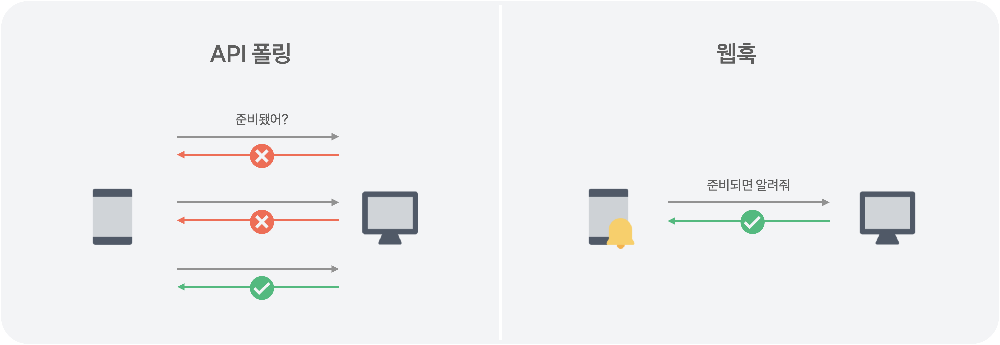
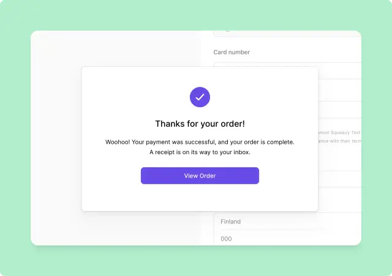
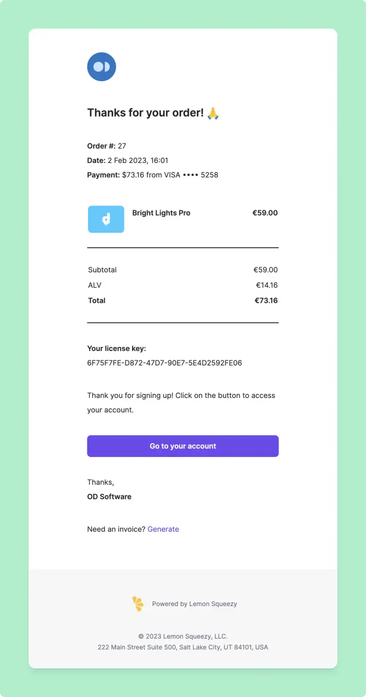

# 레몬 스퀴지 결제

## 웹훅 기반 결제



클라이언트가 API 서버에게 받을 유니크한 URL을 제공하면 이벤트 발생 시 API 서버가 클라이언트에게 해당 이벤트를 전달한다. 이런 특성 때문에 역방향 API라고도 불린다. 레몬 스퀴지는 웹훅 기반 결제를 차용했다. 

### 레몬 스퀴지의 결제

레몬 스퀴지에서 결제 요청은 건 곧 고객에게 체크아웃(계산대) 페이지를 보내는 것을 말한다. 단건 결제, 구독 결제 모두 이 체크아웃 페이지를 사용한다.(카드, 페이팔, 애플페이 결제 가능)

레몬 스퀴지 결제는 2단계로 구분한다. 

1. 고객을 체크아웃 페이지로 리다이렉트 하기

2. 결제가 처리되면 고객, 주문 데이터를 캡쳐링하고 저장하기.

### 체크아웃 URLs

```jsx
# 예시
https://[STORE].lemonsqueezy.com/checkout/buy/[VARIANT_ID]
```

상품마다 고유한 상품 ID가 있다. hosted checkout(페이지 이동), checkout overlay(모달 체크아웃) 두 방식이 제시됨.

### 공유 가능한 checkout URLs vs. Cart URLs

공유 가능한 checkout URLs는 항상 `/checkout/buy/` 를 링크에 포함한다.

고객이 체크아웃 링크를 열면 해당 링크는 항상 cart URL로 변환된다.

- URL이 다음 문구를 포함하도록 변경됨 `/checkout/?cart=`
- 이 cart URL은 해당 고객에게 유일하게 적용되어 한 번만 사용 가능
- Cart URLs는 공유하거나 재사용할 수 없음

### *중요 - checkout URL의 원본을 공유하려면 따라서 항상 `/checkout/buy/` 를 링크에 포함시켜야 함

### API로 체크아웃 만들기

https://docs.lemonsqueezy.com/api/checkouts/create-checkout#checkout_options

https://docs.lemonsqueezy.com/api/checkouts/the-checkout-object

위 문서를 참고해 POST request로 체크아웃 요청을 만들 수 있다.

이 체크아웃 요청 이후 받게 되는 response JSON 데이터의 data.attributes.url이 unique한 리다이렉트용 체크아웃 URL이 된다. 

일반적인 UX → 유저가 “buy” 버튼을 누르면 해당 페이지에 기재된 상품과 유저 데이터를 request에 넣어 레몬스퀴지 체크아웃 API를 호출한다. await를 통해 response를 받게 되면 data.attributes.url의 경로로 고객을 리다이렉트해 레몬 스퀴지 페이지에서 고객이 결제를 완료하게 한다.

### 체크아웃 개선하기

레몬 스퀴지 체크아웃은 커스텀 옵션을 제공한다. 두 가지 방식으로 커스텀할 수 있다. 

- 체크 아웃 URL에 쿼리 파라미터로 커스텀
- 체크아웃 API 호출 시 추가 attributes 세팅으로 커스텀

체크아웃 UI/UX는 앞서 말했듯이 Hosted Checkout(Default)과 Checkout Overlay로 나뉜다.

### 체크아웃 오버레이(모달) 방식 구현

우선 레몬 스퀴지 대시보드에서 product sharing settings → checkout overlay로 이동한다.

checkout overlay에 제공되는 코드 스니펫을 복사해 해당 체크아웃을 제공할 페이지에 복붙한다.

이후 Lemon.js를 사용하면 간편하게 생성할 수 있다.

```jsx
const checkoutUrl = response['data']['attributes']['url'];
LemonSqueezy.Url.Open(checkoutUrl);
```

이때 response의 embed 속성을 true로 오게 한다.(체크아웃 커스텀 옵션의 embed 참고)

### 고객 정보가 사전 기입된 체크아웃 폼 제공하기

UX 개선을 위해 앱이 파악한 고객 정보를 미리 기입한 상태로 체크아웃을 제공할 수 있다.

이름, 이메일 주소, 청구지 주소, tax number, 할인 코드, 수량…

등이 사전 기입 가능한 정보에 해당된다.

### → 쿼리 파라미터로 사전 입력하기

```jsx
https://[STORE].lemonsqueezy.com/checkout/buy/[VARIANT_ID]
?checkout[email]=johndoe@example.com
&checkout[name]=John Doe
&checkout[billing_address][country]=US
&checkout[billing_address][state]=NY
&checkout[billing_address][zip]=10121
&checkout[tax_number]=123456789
&checkout[discount_code]=10PERCENTOFF
```

### → Checkout API 호출 시 사전 입력하기

```bash
curl -X "POST" "https://api.lemonsqueezy.com/v1/checkouts" \
     -H 'Accept: application/vnd.api+json' \
     -H 'Content-Type: application/vnd.api+json' \
     -H 'Authorization: Bearer {api_key}' \
     -d '{
  "data": {
    "type": "checkouts",
    "attributes": {
      "checkout_data": {
        "email": "johndoe@example.com",
        "name": "John Doe"
      }
    },
    "relationships": {
      ...
    }
  }
}'
```

위 명령에서  “checkout_data”: {…}로 표시된 구간이 사전 입력 정보이다. 체크아웃 호출 시 코드 레벨에서 처리할 수 있다. 실제 체크아웃 호출은 가능하면 엣지 펑션, 백엔드 서버에서 처리하게 한다.

### 커스텀 데이터 전달하기

체크아웃에 커스텀 데이터를 전달해 웹훅이나 웹훅 이후 API response(체크아웃 후)에서 활용할 수 있다. 쿼리 파라미터를 사용하거나 API 호출 시 JSON attributes에 세팅해서 사용한다.

```jsx
https://[STORE].lemonsqueezy.com/checkout/buy/[VARIANT_ID]?checkout[custom][user_id]=123
```

```bash
curl -X "POST" "https://api.lemonsqueezy.com/v1/checkouts" \
     -H 'Accept: application/vnd.api+json' \
     -H 'Content-Type: application/vnd.api+json' \
     -H 'Authorization: Bearer {api_key}' \
     -d '{
  "data": {
    "type": "checkouts",
    "attributes": {
      "checkout_data": {
        "custom": {
          "user_id": 123
        }
      }
    },
    "relationships": {
      ...
    }
  }
}'
```

custom 이하 데이터들이 커스텀 데이터에 해당된다.

이 데이터들은 모든 Order 객체의 meta.custom_data에 포함되어 접근할 수 있다. 앱 내에서 구독, 구매에 관련된 데이터를 연계해 저장, 상태변화, 관리할 경우에 웹훅 성공/실패 시 해당 커스텀 데이터를 식별값으로 가지는 튜플에 접근해 상태값을 조정할 수 있다.

### 체크아웃 페이지 커스텀

레몬 스퀴지 대시보드 세팅이나 쿼리 파라미터 설정으로 UI를 커스텀할 수 있다. 색상, 로고 표시 정도

### 커스텀 가격

레몬 스퀴지는 스토어에 프로덕트를 미리 세팅하고 결제에 활용한다. 이때 가격도 세팅해놓는데 앱 UX에 따라 고정된 가격이 아니라 변동가로 접근해야할 때가 있다. 이 경우 쉽게 커스텀 가격으로 전환 가능하다.

커스텀 가격을 적용하려면 체크아웃 API 요청 시에 custom_price 값을 추가해야 한다. 이렇게 하면 custom_price가 기존 프로덕트 가격을 오버라이딩한다. 이 가격은 세금을 반영하지 않는다. 또한 custom_price는 모든 화폐에서 가장 작은 단위로 계산된다.

```bash
curl -X "POST" "https://api.lemonsqueezy.com/v1/checkouts" \
     -H 'Accept: application/vnd.api+json' \
     -H 'Content-Type: application/vnd.api+json' \
     -H 'Authorization: Bearer {api_key}' \
     -d '{
  "data": {
    "type": "checkouts",
    "attributes": {
      "custom_price": 599
    },
    "relationships": {
      ...
    }
  }
}'  
```

위 명령에서 custom_price의 달러 환산가는 $5.99가 된다.

### 프로덕트 디테일 override 하기

가격 뿐만 아니라 프로덕트 세부사항도 오버라이드 할 수 있다. 특가 제공 등의 예외적 상황에 활용하자.

```bash
curl -X "POST" "https://api.lemonsqueezy.com/v1/checkouts" \
     -H 'Accept: application/vnd.api+json' \
     -H 'Content-Type: application/vnd.api+json' \
     -H 'Authorization: Bearer {api_key}' \
     -d '{
  "data": {
    "type": "checkouts",
    "attributes": {
      "product_options": {
        "name": "Unique subscription for Dave",
        "redirect_url": "https://myapp.com/welcome/?user=dave123",
        "receipt_button_text": "Go to your account"
      }
    },
    "relationships": {
      ...
    }
  }
}'
```

https://docs.lemonsqueezy.com/api/checkouts/create-checkout

위 링크에서 product_options를 확인할 수 있다.

### Checkout URLs 만료시키기

특정 시간 안에 결제를 완료하지 못하면 안전을 위해 체크아웃을 폐기하는 게 좋다. 또한 기간제 상품의 경우 만료 기간 설정이 필수다.

만료 기능을 추가하려면 data.attributes에 expires_at 요소를 추가하면 된다. 

```bash
curl -X "POST" "https://api.lemonsqueezy.com/v1/checkouts" \
     -H 'Accept: application/vnd.api+json' \
     -H 'Content-Type: application/vnd.api+json' \
     -H 'Authorization: Bearer {api_key}' \
     -d '{
  "data": {
    "type": "checkouts",
    "attributes": {
      "expires_at": "2023-04-30T23:59:59.000000Z"
    },
    "relationships": {
      ...
    }
  }
}' 
```

data를 넣으면 해당 시간 이후 결제를 할 수 없게 된다.

## 체크아웃 이후

체크아웃 후 결제가 완료되면 해당 사안과 관련된 데이터를 반드시 DB에 저장해야 한다. 체크아웃 이후 유저의 UX는 다음과 같다.

1. 확인 모달



https://docs.lemonsqueezy.com/help/checkout/customizing-confirmation-modal

결제가 완료되면 위와 같은 모달이 표시된다. 

1. 리다이렉트

```bash
curl -X "POST" "https://api.lemonsqueezy.com/v1/checkouts" \
     -H 'Accept: application/vnd.api+json' \
     -H 'Content-Type: application/vnd.api+json' \
     -H 'Authorization: Bearer {api_key}' \
     -d '{
  "data": {
    "type": "checkouts",
    "attributes": {
      "product_options": {
        "redirect_url": "https://example.com/dashboard"
      }
    },
    "relationships": {
      ...
    }
  }
}'
```

유저는 product_options.redirect_url에 세팅된 리다이렉트 위치로 이동된다. 디폴트는 레몬 스퀴지의 My Orders 페이지로 잡힌다.

커스텀 링크로 리다이렉트 하면 위의 확인 모달의 버튼이 View Order가 아니라 Continue로 바뀐다.

1. 영수증



결제를 완료한 고객에게는 위와 같은 영수증 메일이 발송된다. 이메일 영수증도 커스텀할 수 있다.

```bash
curl -X "POST" "https://api.lemonsqueezy.com/v1/checkouts" \
     -H 'Accept: application/vnd.api+json' \
     -H 'Content-Type: application/vnd.api+json' \
     -H 'Authorization: Bearer {api_key}' \
     -d '{
  "data": {
    "type": "checkouts",
    "attributes": {
      "product_options": {
        "receipt_button_text": "Go to your account",
        "receipt_link_url": "https://example.com/dashboard/",
        "receipt_thank_you_note": "Thank you for signing up! Click on the button to access your account."
      }
    },
    "relationships": {
      ...
    }
  }
}'
```

product_options이하의 요소를 커스텀할 수 있다.

### DB에 체크아웃과 구독 데이터 저장하기

### 주문 데이터

order_created 웹훅을 리스닝하거나 Lemon.js의 Checkout.Success 이벤트가 반환하는 data를 사용해 order 관련 데이터를 받아볼 수 있다. 일반적으로 order_created의 id값은 후속처리를 위해 저장해두는 게 좋다.

### 구독 데이터

subscription_created, subscribtion_updated 웹훅을 리스닝해 구독 id를 저장한다. subscription_created 이벤트는 자동으로 order_id를 반환하기에 특별히 order_created 이벤트를 리스닝할 필요가 없다.(구독을 팔았고 order id만 저장하고 싶은 경우)

향후 구독 정책이 변경될 경우를 대비해 product_id와 variant_id도 함께 저장하는 게 좋다.

구독과 관련해 추가적인 내용은 현재 앱에 적용되지 않기에 생략한다.

### 주문 데이터 저장으로 UX 개선하기

UX 개선을 위해 status, trial_ends_at, renews_at, ends_at, card_brand, card_last_four의 값은 저장해뒀다가 유저의 구독 정보 페이지에서 보여주는 게 좋다.

## 웹훅과 앱(상태기계, DB) 싱크 맞추기

현재 앱에 구독 기능은 고려되고 있지 않음으로 단건 결제와 관련된 웹훅만 나열해보면 다음과 같다.

```bash
order_created -> 주문을 성공적으로 완료
order_refunded -> 환불(전체/부분) 완료
license_key_created -> 주문에서 라이센스 키가 생성될 때 발생, order_created가 항상 같이 발생
license_key_updated -> 라이센스 키 업데이트
afiliate_activated -> 제휴 활성화
```

복잡성을 최소화 하려면 order_created만 써도 된다.

```bash
{
  "meta": {
    "event_name": "subscription_created"
  },
  "type": "subscriptions",
  "id": "1",
  "attributes": {
    "store_id": 1,
    "customer_id": 1,
    "order_id": 1,
    "order_item_id": 1,
    "product_id": 1,
    "variant_id": 1,
    "product_name": "Lemonade",
    "variant_name": "Citrus Blast",
    "user_name": "John Doe",
    "user_email": "johndoe@example.com",
    "status": "active",
    "status_formatted": "Active",
    "card_brand": "visa",
    "card_last_four": "42424",
    "payment_processor": "stripe",
    "pause": null,
    "cancelled": false,
    "trial_ends_at": null,
    "billing_anchor": 12,
    "first_subscription_item": {
      "id": 1,
      "subscription_id": 1,
      "price_id": 1,
      "quantity": 5,
      "created_at": "2021-08-11T13:47:27.000000Z",
    "updated_at": "2021-08-11T13:54:19.000000Z",
    "test_mode": false
  }
}
```
```
```

### 웹훅 생성하기

대시보드로 생성, API 호출 방식이 있는데 트래픽이 많은 경우 후자를 사용해야 한다.

```javascript
POST https://api.lemonsqueezy.com/v1/webhooks
```
POST request로 웹훅에 구독할 데이터(이벤트 정보, 웹훅 결과를 받을 엔드 포인트), 시크릿 키 등을 포함시켜 아래와 같이 전송한다.

```
```
```json
```
{
  "data": {
    "type": "webhooks",
    "attributes": {
      "url": "https://example.com/webhooks/",
      "events": [
        "order_created",
        "subscription_created",
        "subscription_updated",
        "subscription_expired"
      ],
      "secret": "SIGNING_SECRET"
    },
    "relationships": {
      "store": {
        "data": {
          "type": "stores",
          "id": "1"
        }
      }
    }
  }
}
```

```
### 앱에 엔드 포인트 만들기

웹훅 request가 POST로 오기 때문에 해당 웹훅을 송신할 엔드포인트를 만들어 놔야 한다. 

또한 엔드 포인트에서 Lemon Squeezy의 웹훅을 제대로 수신했음을 알릴 때 HTTP 200을 반환해야 한다. 다른 수신 코드는 실패로 간주되어 동일 이벤트가 최대 세 번 까지 재전송된다. 네 번째 이벤트까지 HTTP 200을 반환하지 않으면 이벤트는 더이상 자동으로 송신되지 않는다.

레몬 스퀴지에서는 웹훅 이벤트를 지역적으로라도 캐싱, 또는 DB에 저장하고 바로 HTTP 200을 반환하는 흐름을 권장한다. 이렇게 하면 빠르게 성공 신호를 반환하면서 외부에서도 웹훅 데이터에 접근할 수 있다. 또한 웹훅에 이상이 발생해 디버깅이 필요한 상황에도 캐싱하거나 DB에 저장한 데이터를 활용해 문제를 해결할 수 있게 된다.

### 웹훅에 서명하고 요청을 유효화하기

엔드 포인트에 도달한 웹훅 데이터가 실제 Lemon Squeezy에서 전송한 데이터인지 확인하기 위해 반드시 event data와 함께 전송된 signature를 확인해야 한다.

이 시그니처는 `X-Signature` 헤더에 붙여 전송되며 해시값이다. 해시값은 웹훅을 만들 때 사용한 signing secret으로 만들어진다.

https://docs.lemonsqueezy.com/help/webhooks/signing-requests

웹훅이 유효한지 확인하기 위해 반드시 일치하는 해시값을 생성해 이 해시값이 헤더에 있는 시그니처와 일치하는지 확인해야 한다.

### 웹훅 정의하기

1. 콜백 URL 정의 -> 이벤트 동작 시 레몬 스퀴지가 POST request를 보낼 URL을 설정한다.
2. 시크릿 서명하기 -> 랜덤 스트링 6 - 40 자를 비밀키로 세팅한다. 백엔드에서는 이 키로 정품 확인
3. List of events -> 이 웹훅을 트리거할 이벤트 리스트 정의

### 커스텀 데이터 보내기

체크아웃에 커스텀 데이터를 추가하면 체크아웃 이벤트로 발생하는 웹훅이 해당 데이터를 사용할 수 있다. 

### 웹훅 이벤트 보기

최근 보낸 웹훅 로그는 웹훅 세팅 페이지에 기록된다.

### 웹훅 Request

레몬 스퀴지 웹훅은 웹훅을 트리거한 이벤트가 명시된 JSON POST다.
```JSON
Content-Type: application/json
X-Event-Name: order_created
X-Signature: {signature}
```

레몬 스퀴지에 웹훅 이벤트\(체크아웃, 구독...\)가 감지되면 설정된 웹훅이 전송  
백엔드 서버는 웹훅을 성공적으로 받았음을 알리기 위해 200 코드를 보내야 한다.  
만약에 200 response가 발송되지 않으면 웹훅은 3회\(5, 15, 125초 간격\) 자동 재전송 된다.  

```json
```json
{
  "meta": {
    "event_name": "order_created",
    "custom_data": {
      "customer_id": 25
    }
  },
  "data": {
    "type": "orders",
    "id": "1",
    "attributes": {
      "store_id": 1,
      "customer_id": 1,
      "identifier": "104e18a2-d755-4d4b-80c4-a6c1dcbe1c10",
      "order_number": 1,
      "user_name": "John Doe",
      "user_email": "johndoe@example.com",
      "currency": "USD",
      "currency_rate": "1.0000",
      "subtotal": 999,
      "discount_total": 0,
      "tax": 200,
      "total": 1199,
      "subtotal_usd": 999,
      "discount_total_usd": 0,
      "tax_usd": 200,
      "total_usd": 1199,
      "tax_name": "VAT",
      "tax_rate": "20.00",
      "status": "paid",
      "status_formatted": "Paid",
      "refunded": false,
      "refunded_at": null,
      "subtotal_formatted": "$9.99",
      "discount_total_formatted": "$0.00",
      "tax_formatted": "$2.00",
      "total_formatted": "$11.99",
      "first_order_item": {
        "id": 1,
        "order_id": 1,
        "product_id": 1,
        "variant_id": 1,
        "product_name": "Test Limited License for 2 years",
        "variant_name": "Default",
        "price": 1199,
        "created_at": "2021-08-17T09:45:53.000000Z",
        "updated_at": "2021-08-17T09:45:53.000000Z",
        "deleted_at": null,
        "test_mode": false
      },
      "urls": {
        "receipt": "https://app.lemonsqueezy.com/my-orders/104e18a2-d755-4d4b-80c4-a6c1dcbe1c10?signature=8847fff02e1bfb0c7c43ff1cdf1b1657a8eed2029413692663b86859208c9f42"
      },
      "created_at": "2021-08-17T09:45:53.000000Z",
      "updated_at": "2021-08-17T09:45:53.000000Z"
    },
    "relationships": {
      "store": {
        "links": {
          "related": "https://api.lemonsqueezy.com/v1/orders/1/store",
          "self": "https://api.lemonsqueezy.com/v1/orders/1/relationships/store"
        }
      },
      "customer": {
        "links": {
          "related": "https://api.lemonsqueezy.com/v1/orders/1/customer",
          "self": "https://api.lemonsqueezy.com/v1/orders/1/relationships/customer"
        }
      },
      "order-items": {
        "links": {
          "related": "https://api.lemonsqueezy.com/v1/orders/1/order-items",
          "self": "https://api.lemonsqueezy.com/v1/orders/1/relationships/order-items"
        }
      },
      "subscriptions": {
        "links": {
          "related": "https://api.lemonsqueezy.com/v1/orders/1/subscriptions",
          "self": "https://api.lemonsqueezy.com/v1/orders/1/relationships/subscriptions"
        }
      },
      "license-keys": {
        "links": {
          "related": "https://api.lemonsqueezy.com/v1/orders/1/license-keys",
          "self": "https://api.lemonsqueezy.com/v1/orders/1/relationships/license-keys"
        }
      },
      "discount-redemptions": {
        "links": {
          "related": "https://api.lemonsqueezy.com/v1/orders/1/discount-redemptions",
          "self": "https://api.lemonsqueezy.com/v1/orders/1/relationships/discount-redemptions"
        }
      }
    },
    "links": {
      "self": "https://api.lemonsqueezy.com/v1/orders/1"
    }
  }
```

커스텀 데이터는 meta.custom_data에 있다.
