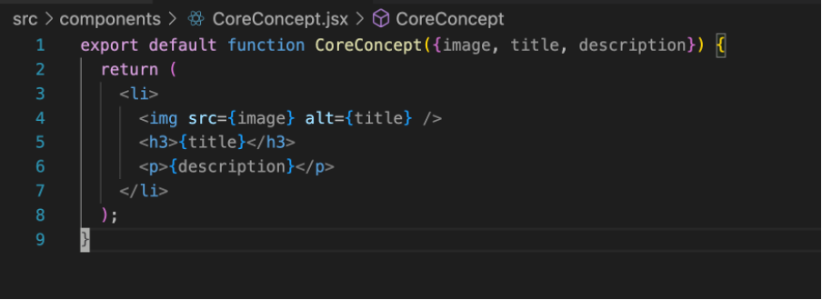
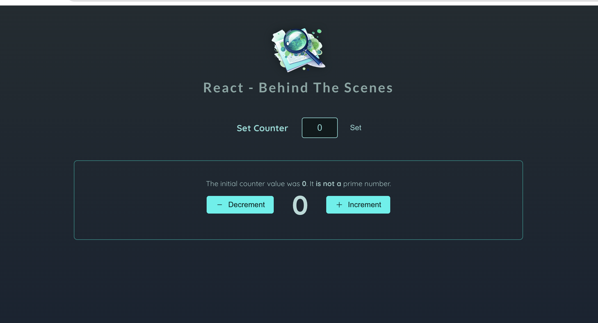
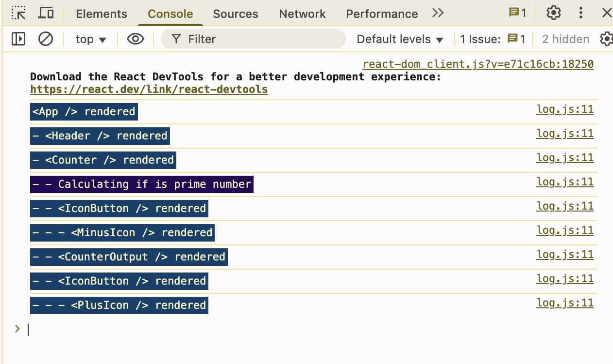
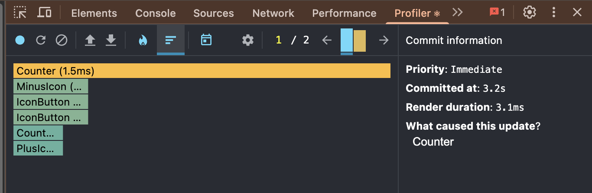
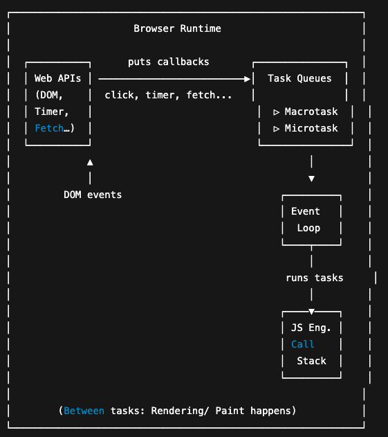

# 리액트 학습(Udemy-React - The Complete Guide 2025 (incl. Next.js, Redux)

## **리액트**

함수 컴포넌트형 JS 라이브러리. HTML/CSS/JS를 파일 포맷으로 구분하지 않고 UI 컴포넌트로 구분하자는 게 핵심 아이디어.JS로 만든 라이브러리이기 때문에 당연히 .js로 최종 컴파일된다. 하지만 Vite 등의 빌더 툴 내의 Babel 같은 트랜스파일러의 도움을 받아 요새는 대부분 .jsx 또는 .tsx로 작성된다.

.jsx(extended .js)는 원래의 js 컴파일러는 컴파일할 수 없는 확장된 구문을 제공한다. 쉽게 말하면 js코드에 뒤섞인 HTML이 .jsx가 제공하는 확장된 구문이다. 아래 예시를 보면 리액트의 UI 컴포넌트가 어떤 식으로 HTML/CSS/JS를 하나의 함수로 모듈화 하는지 알 수 있다.



하나의 자바스크립트 함수 ```CoreConcept({image, title, description})```에 HTML(return문 전체), JS가 섞여 있다.

CSS 또한 위 태그에 인라인 스타일링 방식으로 ```<p style={{color: “green”}}>{description}</p>```처럼 적용할 수 있다. 다만 이 방식은 .jsx 기능이 아니라 JS 라이브러리인 styled-component가 제공하는 기능이다. 이렇게 한 소스 파일 안에서 HTML/CSS/JS + 리액트 라이브러리의 모든 요소를 활용하다 보니 편리한 만큼 복잡성도 커진다. 그렇기 때문에 리액트의 작업 프로세스 안에 다양한 의존 라이브러리가 들어와 있다는 걸 인지한 채로 학습하는 게 좋을 것 같다. .jsx, react, styled-component 등 여러 의존성이 각자 어떤 역할을 수행하는지 알고 학습해야 문제 발생 시에 정확한 원인을 찾아 해결할 수 있다.

이 함수는 최상위 컴포넌트인 App.jsx에서 최종적으로 활용된다.JS 구문 안에서 쓰인 HTML이 .jsx 구문이다. 조금 심화하면 저렇게 HTML로 쓰인 구문이 트랜스 파일러(보통 Vite같은 빌더 툴에 포함)로 비슷한 추상화 레벨의 언어인 JS로 번역된다.


.jsx를 .js 파일로 트랜스파일하면 위의 HTML이 아래의 React.createElemenet 함수와 그 인자로 번역된다.

.jsx 내부에서 자바스크립트 문법을 쓰려면 {}로 래핑해야 한다. 위 예시에서도 ```<h1>Hello, {name}!\</h1>``` 과 같이 .jsx 문법으로 쓰인 
```<h1>``` 태그 안에 JS로 선언된 name을 넣기 위해 대괄호로 감싸준 모습을 볼 수 있다. 이것과 별개로 ```CoreConcept({image, title, description})```처럼 함수의 파라미터에 들어간 ```{image, title, decription}```은 JS의 네이티브 디스트럭쳐링 문법이므로 .jsx와 혼동하면 안된다.

## **리액트의 동작**

작성된 UI 컴포넌트들은 최상위 App() 함수에서 조합되어 쓰인다.


이 App() 함수는 리액트 프로젝트의 디폴트 엔트리 포인트이다. 그런데 리액트는 어떻게 App() 함수를 실행해서 브라우저의 프론트 페이지 전체를 구성하는 것일까? 리액트의 프론트 페이지는 리액트 프로젝트 내의 index.html이라는 단일 페이지로 드러난다. 아래의 프론트 페이지는 위 App() 함수의 실제 실행 결과로 만들어진 프론트 페이지이다.


위 페이지의 HTML 파일인 index.html의 내용은 다음과 같다.


9-12번까지 정의된 ```<body>``` 태그를 보면 ```<div id=”root”>``` 태그로 감싼 ```<script type=”module” src=”/src/index.jsx”></script>```가 보인다. 그것 뿐이다. 그 외에 페이지에 보이는 다른 태그들을 찾아볼 수 없다. 모두 어디로 간 것일까? 답은 ```<div id=”root”>``` 태그로 감싼 ```<script type=”module” src=”/src/index.jsx”></script>```에 있다. 이 script 태그 한 줄에 있는 index.jsx 파일이 전체 화면을 만들어내는 것이다. index.jsx파일은 어떻게 단 한 줄의 script 태그로 리액트 페이지 전체를 구성하는 것일까? 

→ 빌드된 JS 번들 안에 index.jsx를 시작으로 하는 모든 컴포넌트 트리가 등록되기 때문이다. 이제 index.jsx 파일의 내용을 보자.


7-8번과 주석처리된 10번의 코드는 모두 동일한 작업을 수행한다.

8번을 보자.

리액트는 VDOM이라는 가상의 DOM(Document Object Model)객체를 만들어 UI 컴포넌트를 관리한다. ReactDOM은 메모리 상의 추상화된 UI 트리구조인  VDOM을 실제 DOM으로 변환하는 역할을 한다. 이때 ```createRoot(entryPoint)``` 함수는 ReactDOM이 가상의 VDOM을 실제 DOM과 연결하기 위한 앵커 지점(root DOM node) 을 설정하게 한다. 엔트리 포인트는 VDOM과 DOM 공통의 시작 노드가 된다.

### DOM(Document Object Model)

DOM은 HTML/CSS내의 문서적 요소를 JS 내의 객체로 다룰 수 있게 만든 모델이다. DOM은 최상위 루트 노드를 기준으로 이하의 element(태그 요소)와 attribute(태그 요소가 가지고 있는 속성들, 이를테면 ```<div id=”root”></div>```에서 ```id=”root”```와 같은 속성)을 노드로 갖는 트리 구조로 구성된다.

다시 리액트로 돌아가면 리액트는 DOM을 만들어 브라우저에 보내기 전에 리액트의 추상화된 UI 모델인 VDOM(Virtual DOM)을 활용한다. VDOM이라는 추가적인 단계를 두는 이유는 Synthetic Event, 컴포넌트 관리(앞서 말한 HTML/CSS/JS가 합쳐진 통합 UI 컴포넌트), 부분 렌더링(상태 관리를 통해 기존의 DOM과 리액트만의 VDOM을 diffing한 후 부분적으로만 렌더링 처리)등 리액트만의 최적화된 기술을 적용하기 위함이다.

7번 코드를 보면 ```const entryPoint```에 ```document.getElementByID(”root”)```를 통해 HTML의 ```<div id=”root”>``` 요소가 할당된다.

```ReactDOM```은 ```.createRoot(entryPoint)```로 DOM의 엔트리 포인트로 이 ```entryPoint``` 객체를 할당한다.

이 객체는 이전의 index.html에서 ```<div id=”root”>``` 태그에 해당된다. 이후 ```ReactDOM.render(<App />)```를 통해 App 컴포넌트의 모든 UI 요소가 ```<div id="root">``` 내부에 렌더링된다.

지금까지 index.html -> index.jsx -> App()으로 이어지는 리액트의 작업 흐름을 알아봤다.

리액트의 방식이 DOM 객체를 다루는 기존의 패러다임을 완전히 바꿔놓은 것 같다는 생각이 든다. 기존의 프론트 처리 방식은 HTML/CSS로 미리 정의된 문서 요소를 JS 내부에서 객체화하고 이를 조작하는 수순이었다. 웹의 역사와 관련이 있는 것 같은데, 텍스트 문서를 관리하기 위해 HTML이라는 레이아웃 처리용 마크업 언어가 등장했고, 이후 시각적 효과를 위해 CSS가 독립했다. 자바스크립트의 전신인 라이브 스크립트는 최종적으로 마크업 문서와 시각적 요소의 상호작용을 구현하고자 고안됐다. 그리고 프론트 페이지의 개발은 이렇게 독립적인 역할로 구분된 문서들을 JS로 연결, 조작하는 명령형 방식으로 진행됐다.

그러나 리액트의 작업흐름은 전통적인 프론트엔드의 작업 흐름을 역전시켰다. 리액트는 index.html에서 볼 수 있듯, 미리 정의하는 HTML/CSS 요소를 최소화한다. 이전에 HTML/CSS에서 미리 정의하고 객체화했던 문서 요소는 이제 더이상 JS 바깥에 미리 선언되지 않는다. 리액트와 .jsx, tailwindCSS등의 라이브러리가 HTML/CSS 요소를 별도의 객체로 정의하지 않고도 JS와 함께 사용할 수 있게 해준 덕이다. 리액트는 그것들을 함수로 감싸 JS의 함수처럼 다룬다. 

이렇듯 리액트는 선언형 프로그래밍 방식으로 UI를 구성한다. 이렇게 하면 기존 명령형 방식의 DOM 조작보다 코드의 유지보수성과 재사용성이 뛰어나다는 장점이 있다.

### +브라우저의 DOM의 렌더링 과정(렌더링 엔진)

1. 브라우저의 렌더링 엔진이 HTML을 파싱해 트리 구조의 DOM으로 만든다.
2. 1번 과정에서 CSS 파일을 만나면 해당 CSS 파일도 다운로드한다.
3. 2번에서 다운로드한 CSS를 파싱해 트리 구조의 CSSOM을 만든다.
4. DOM을 순회한다. 이떄 보이지 않는 요소(display : none)는 제외한다. 이때 순회중인 노드에 CSSOM 정보가 있다면 여기서 발견한 CSS를 이 노드에 적용한다. 이 과정은 5, 6번으로 구분된다.
5. 레이아웃: 순회한 DOM 노드를 기반으로 레이아웃 연산을 한다. 레이아웃 과정을 거치면 반드시 페인팅 과정도 거친다. 
6. 페인팅: 레이아웃 연산이 끝난 노드에 실제 CSS를 적용한다.


### +VDOM(react-dom)

SPA(Single Page Application)으로 브라우저는 페이지 변경시마다 새 HTML을 받지 않고도 페이지의 변경사항을 적용해 매끄러운 렌더링을 할 수 있게 됐다. 기존 방식은 브라우저가 화면을 새로 그릴 때마다 이전 화면이 초기화되어 깜빡임이 발생했다. SPA는 부분 렌더링을 통해 기존의 맥락과 다음 페이지의 맥락을 유기적이고 매끄럽게 연결했다.(화면이 부드러워지는 것 뿐 아니라 화면 변경 시에도 데이터 스트리밍 맥락을 유지한다. 유튜브 뮤직을 떠올려 보자.) 

그러나 이 경우 기존 DOM을 폐기하고 새 HTML을 다시 그리는 방식보다 더 큰 연산 비용이 요구됐다. 하나의 페이지에서 계속해서 요소의 위치를 재계산해야 하기 때문이었다. SPA는 라우팅 변경 시 사이드바, 헤더와 같은 고정 요소를 제외한 모든 요소를 삭제, 삽입, 위치 계산을 수행해야 했다. 

이런 연산비용 문제를 해결하기 위해 등장한 것이 VDOM이다. react-dom은 VDOM을 만들어 온전히 브라우저가 부담해야 했을 렌더링 연산을 프론트엔드 서버에서 분담할 수 있게 만들었다.

**React Fiber**

리액트 파이버는 리액트에서 관리하는 JS 객체이다. 파이버 재조정자(Fiber Reconciler)가 관리하는데, 앞서 얘기한 DOM과 VDOM를 비교해 변경 사항을 수집하며 여기서 차이가 발생하면 관련 정보를 가지고 있는 파이버를 기준으로 화면에 렌더링을 요청한다. 재조정(Reconciliation)은 리액트가 어떤 부분을 다시 렌더링해야 하는지 VDOM, DOM을 비교하는 작업(알고리즘)이다.

### +VDOM을 활용한 부분 렌더링(렌더링 최적화)

VDOM은 컴포넌트 상태가 변경될 때(```useState()```가 할당된 클로저의 참조값이 바뀔 때), 모든 DOM을 다시 그리는 게 아니라 변경된 부분만 찾아 실제 DOM에 반영하기 위해 사용한다. 

상태 변화 이전의 VDOM과 현재의 VDOM을 diff해서(Reconciliation) 차이가 있는 부분만 다시 렌더링하기 때문에 컴포넌트 함수가 다루는 모든 DOM 요소를 다시 그릴 필요가 없다. 달리 말해 렌더링이 다시 요구될 때, 컴포넌트 함수의 모든 라인은 재실행되지만 VDOM과 비교해 상태가 변경된 DOM 요소만 다시 그린다. → 함수 내부의 특정 변수가 변경돼도 그 변수가 상태값이 아니면 변화를 렌더링에 반영하지 않는다.

### +리액트의 렌더링

위에서 브라우저의 렌더링을 학습했는데 리액트의 렌더링은 브라우저의 렌더링과 구분되는 개념이다. 위에서 SPA의 연산 부담을 줄이기 위해 리액트가 VDOM을 사용한다는 것을 배웠다. 리액트의 렌더링은 이처럼 브라우저에게 연산 부담을 주기 전에 프론트 엔드 서버(리액트 프로세스)가 우선적으로 렌더링 연산을 하는 것을 말한다.

더 구체적으로 리액트 렌더링은 리액트 애플리케이션 트리 안에 있는 모든 컴포넌트들이 자신의 props와 state 값을 기반으로 어떻게 UI를 구성하고, 그렇게 구성한 DOM 결과를 브라우저에 제공할 것인지 계산하는 일련의 과정을 의미한다. 만약 컴포넌트가 상태값을 가지고 있지 않다면 해당 컴포넌트가 반환하는 JSX 값에 기반해 렌더링이 계산된다. 리액트에서 렌더링이 언제 어떻게 일어나는지 보다 구체적으로 알아보자.

1. 최초 렌더링: 사용자가 앱에 진입할 때, 리액트는 브라우저에 앱 정보를 제공하기 위해 최초 렌더링을 수행.
2. 리렌더링: [함수형 컴포넌트만 다룸] useState()의 세터가 실행되는 경우, useReducer()의 dispatch가 실행되는 경우, 컴포넌트의 key props가 변경되는 경우, 부모 컴포넌트가 리렌더링되는 경우 자식 컴포넌트도 무조건 리렌더링 됨.
- 리액트에서 key는 모든 컴포넌트에서 사용할 수 있는 특수 props다. 일반적으로는 배열에서 하위 컴포넌트를 선언할 때 사용된다. 리렌더링이 진행되는 동안 리스트나 테이블의 동종적인 형제 요소들을 구분하기 위해 쓰인다. key가 없으면 파이버 내부의 sibling(형제 요소의 속성) 인덱스만으로 구별해야 한다.

**렌더와 커밋**

렌더링 프로세스는 렌더와 커밋 2단계로 나뉜다. 렌더 단계에서는 컴포넌트를 렌더링하고 변경 사항을 계산한다. 크게 types, props, key를 이전의 VDOM을 비교한다. 커밋 단계는 렌더 단계의 변경 사항을 실제 DOM에 적용해 사용자에게 보여주는 과정을 말한다. 이 단계가 끝나야 브라우저의 렌더링이 실행된다.

중요한 사실은 리액트의 렌더링이 실행됐다고 해서 무조건 DOM 업데이트가 일어나는 게 아니라는 점이다. 리액트가 렌더링을 수행했지만 커밋할 필요가 없다면, 달리 말해 변경 사항이 없다면 커밋 단계는 생략된다. 렌더링 연산은 했지만 변화는 없을 수 있는 것이다. 

렌더와 커밋은 항상 동기식으로 작동했다. 불가피하게 렌더링의 요구 연산량이 커질수록 앱 성능 저하가 발생했다. 이에 대한 한 가지 대안으로 리액트 18은 우선순위를 둔 비동기 렌더링, 다른 말로 동시성 렌더링을 도입했다. A 컴포넌트의 렌더링 작업이 무겁지만 B, C 컴포넌트는 상대적으로 가벼운 경우, 의도된 우선순위로 B, C 컴포넌트의 변경 사항만 우선적으로 렌더링할 수 있다. 이에 관해서는 나중에 리액트 18버전을 공부하며 심화하자.

### +JS엔진이 하는 일과 브라우저가 하는 일

자바스크립트 코드로 이벤트 처리, 타이머 설정, DOM 조작까지 처리하니 그걸 다 JS엔진이 한다고 착각할 수 있다. 그러나 실제로 JS 엔진이 하는 일은 다음과 같다.

1. 파싱 → 코드를 토큰으로 바꾸고 AST(Abstract Syntax Tree)로 변환, 구문 오류 감지
2. 컴파일(인터프리터 + JIT 컴파일러) → 인터프리터가 느리게 실행하다가 반복되는 함수나 루프는 JIT 컴파일러가 기계어로 변환, 빠르게 재사용
3. 실행 → 변수 할당, 객체 생성, 스코프 관리 등 코드 연산 처리
4. 콜백 큐와 이벤트 루프 인터페이스 처리 → 이벤트 루프는 브라우저/Node.js에서 담당하지만 콜백을 콜 스택에 밀어넣고, 그 콜백이 돌아왔을 때 실행하는 건 JS엔진
5. 가비지 컬렉션

**브라우저가 하는 일**

1. DOM 조작(렌더링 엔진)
2. 이벤트 처리
3. 네트워크 요청(fetch 등)
4. 타이머(setTimeout 등)
5. localStorage 등 Web API

### +리액트의 Synthetic Event

리액트는 브라우저의 ```addEventListner()```를 직접 쓰지 않는다. 대신 자체적으로 ```SyntheticEvent ```시스템을 구현해서 이벤트 리스닝은 최상위에서 한 번만 하고, 이벤트 버블링을 통해 이를 가능하게 한다.

리액트에서는 UI 컴포넌트에서 ```onClick``` 같은 이벤트가 발생하면 VDOM 트리를 따라가며 어떤 컴포넌트에 해당 이벤트가 연결됐는지 탐색한다. 이때``` onClick={handleClick}``` 처럼 등록된 함수는 리액트 내부의 디스패처가 찾아서 콜백처럼 호출해준다. 

원래 DOM의 이벤트 흐름은 다음과 같다.

1. Capturing Phase(루트에서 타겟까지 하향 전파, ```addEventListener()```로 리스닝)
    
    document → html → body → target
    
2. Target Phase(이벤트가 발생한 노드에서 처리됨)
3. Bubbling Phase(타겟에서 루트까지 상향 전파)
    
    target → body → html → document
    

실제 DOM 요소에 리스너를 걸어 진행된다. 그러나 리액트는 성능, 추상화, 일관성을 위해 이벤트를 DOM 요소마다 직접 붙이지 않는다.

**리액트의 SyntheticEvent**

```container.addEventListener('click', globalClickHandler);```
최상위 루트 DOM 요소(```container```)에 한 번만 리스너를 붙이고 이를 활용한다.

클릭 같은 이벤트가 발생하고 브라우저가 이를 DOM 트리 위로 상향 버블링하면 리액트는 루트에서 이 이벤트를 가로채  ```SyntheticEvent``` 객체(크로스 브라우저 문제 해결, 단일 인터페이스 제공)로 래핑한다. 이후 이벤트의 target을 기준으로 VDOM을 하향 탐색해서 해당 노드에 연결된 onClick을 찾아내고 등록된 콜백을 호출한다. 

**이벤트 위임과 이벤트 버블링**

```addEventListener```가 이벤트 발생 노드에 모두 있으면 가장 빠르게 이벤트에 대처할 수 있지만 그렇게 되면 이벤트 리스닝을 위해 낭비되는 메모리가 너무 커진다. 

```<ul>, <table>``` 같은 요소는 동질적인 자식 요소를 많이 두는데 이 모든 자식 요소에 일일이 이벤트리스너를 붙이면 메모리가 감당이 안 된다. 그래서 부모 요소인 ```<ul>, <table>``` 등의 이벤트 리스너를 하나만 정의하고 자식 노드에서 발생한 이벤트는 상향 propagation 되는 이벤트 버블링 → 이벤트 위임 패턴이 등장했다. 이때 부모는 자식 노드로부터 이벤트 처리를 위임받는다. 

리액트의 ```SyntheticEvent``` 처리는 위와 같은 기존의 이벤트 버블링 패턴을 극적으로 활용한 사례이다.

## Props, State, Two-Way-Binding

**Props**

부모 컴포넌트가 자식 컴포넌트에 데이터를 전달하는 수단.

읽기 전용(immutable) 객체 형태로 전달된다.

```jsx
function Welcome(props) {
	return <h1>Hello, {props.name}</h1>;
}

<Welcome name="Ironist" />
```

리액트에서는 구조 분해 할당 방식으로도 많이 사용된다.

```jsx
function Welcome({name, email}) {
	return (
	<h1>Hello, {name}</h1>
	<p>Your email: {email}</p>
	);
}

<Welcome name="Ironist" email:"hello123@gmail.com" />
```

```jsx
props = {
	name: 'Ironist',
	email: 'hello123@gmail.com'
}
```

위에서 Welcome의 속성으로 전달된 props는 위와 같은 객체로 전달된다.

```jsx
function Card({ children }) {
  return <div className="card">{children}</div>;
}

<Card>
  <p>Hello world</p> // children
</Card>
```

태그 사이에 다른 요소가 있으면 props는 자동으로 children이라는 이름의 프로퍼티를 갖는다.

```jsx
function Button({ onClick }) {
  return <button onClick={onClick}>Click me</button>;
}

<Button onClick={() => alert("Clicked")} />
```

부모 컴포넌트에서 자식 컴포넌트로 이벤트 핸들러 연결 시 함수도 전달한다.

```tsx
type WelcomeProps = {
  name: string;
};

function Welcome({ name }: WelcomeProps) {
  return <h1>Hello, {name}</h1>;
}

```

TS에서는 위와 같은 방식으로 선언해 props의 타입 안정성을 확보한다.

Props는 전통적 상속 구조를 따르지 않고 하향식으로 데이터를 전달한다. Props 전달은 명시적으로 이루어지며 단방향 데이터 흐름(Unidirectional Data Flow)를 보인다. 

**State**

컴포넌트 내부에 상태를 선언하고, 그 상태 변화에 따라 UI를 자동 갱신하는 훅이다.

```tsx
const [count, setCount] = useState(0);
```

useState()는 현재 상태값과 해당 값을 갱신하는 함수를 포함한 튜플을 반환한다. 0번 인덱스는 상태값 배열을 저장하고 1번 인덱스는 0번 인덱스의 상태값을 저장하기 위한 세터를 저장한다. 이때 상태는 리액트의 렌더링 컨텍스트(리액트 파이버)에 저장되며, setState()는 해당 상태 업데이트를 예약하는 함수다. 상태는 직접 접근하거나 수정할 수 없고, setState()를 통해서만 간접적으로 조작할 수 있다. 
→ 컴포넌트 밖에서 state를 수정하면 안 되니까. → count를 직접 수정해도 렌더링에 반영하지 않는다. 리액트는 setState() 호출 시에만 재렌더링 요청을 인지한다.
setState가 호출되면 렌더링 트리거가 작동해 해당 컴포넌트를 다음 렌더링 사이클에 재렌더링한다. ‘**다음**’ 렌더링 사이클에 **비동기적**으로 렌더링 하는 것이다. setState 호출시 즉각적으로 재렌더링된다고 착각해서는 안된다. 

state는 props와 달리 컴포넌트 내부에 설정되며 내부에서만 관리하고, 변경 가능한 동적인 데이터를 담는다. 반면 props는 외부에서 전달받은 읽기 전용 데이터로 컴포넌트를 사용하기 위한 정적 설정값이다. 컴포넌트 바깥에서 값이 조정될 수는 있어도 컴포넌트 안에 전달되면 정적으로만 사용되는 고정된 값이다.

```tsx
function Parent() {
  const [count, setCount] = useState(0);

  return (
    <Child count={count} onIncrement={() => setCount(count + 1)} />
  );
}

function Child({ count, onIncrement }) {
  return (
    <>
      <p>{count}</p>
      <button onClick={onIncrement}>증가</button>
    </>
  );
}

```

위 예시에서 Parent의 state가 정적인 props로 Child에 전달되는 것을 확인할 수 있다. Child 컴포넌트는 내부에서 직접 Parent의 state를 조작하지 않고, 읽기 전용 데이터로 UI를 세팅하는데 활용한다. Child는 상태 변경 로직을 직접 가지고 있지는 않지만, props로 전달받은 콜백 함수를 실행함으로써 Parent의 상태를 변경하는 트리거 역할을 한다.

**Two-Way-Binding**

UI와 데이터 모델이 연결되어 실시간으로 쌍방향 상호작용 하는 것.

입력이 모델을 바꾸고 모델의 변화가 입력값 상태를 바꾼다.

```tsx
import { useState } from 'react';

function TwoWayBindingExample() {
  const [name, setName] = useState('');

  const handleChange = (event) => {
    setName(event.target.value);
  };

  return (
    <div>
      <input type="text" value={name} onChange={handleChange} />
      <p>입력한 이름: {name}</p>
    </div>
  );
}

```

위의 사례처럼 input 칸에 텍스트를 입력하면 실시간으로 입력 텍스트가 변하는 상황이 대표적인 예시이다. 사용자의 입력이 실시간으로 name 데이터에 반영되고, setName이 호출되었으므로 리액트가 다시 name의 상태 변화를 재렌더링하는 순환이 발생한다.

원래 리액트는 단방향 바인딩 방식을 사용해 데이터 흐름이 명확하다는 게 장점이다. 그러나 이렇게 필요한 경우 명시적인 방법(상태관리 + 이벤트 핸들러)으로 양방향 바인딩을 직접 구현할 수 있다. 실시간 입력 반영, Form 상태 처리 또는 입력값이 즉각적으로 UI에 표시되어야 할 때 활용하면 된다.

## Lifting State Up, Computing Value

상태 끌어올리기는 상태가 두 개 이상의 컴포넌트에서 필요할 때, 그 상태를 각각의 컴포넌트에 두지 않고 가장 가까운 공통 부모 컴포넌트로 이동시키는 것을 말한다.

→ 여러 자식이 하나의 상태를 공유하기 때문에 컴포넌트 마다 값이 불일치하게 되는 문제를 방지할 수 있다.

 

```jsx
function Parent() {
  const [value, setValue] = useState('');

  return (
    <>
      <ChildA value={value} onChange={setValue} />
      <ChildB value={value} />
    </>
  );
}

function ChildA({ value, onChange }) {
  return <input value={value} onChange={e => onChange(e.target.value)} />;
}

function ChildB({ value }) {
  return <p>{value}</p>;
}
```

state를 부모 컴포넌트에서 한 번만 정의하고 자식 컴포넌트에 props로 넘기는 방식으로 동작한다. ChildA가 상태를 바꾸면 ChildB에도 자동으로 최신 값이 반영된다. → Single Source of Truth 확보

단, 상태를 너무 위로 올리면 불필요한 리렌더링이 많아질 수 있다. 또 상태가 복잡해지면 상태관리 라이브러리(Redux, Zustand 등)로 대체하는 경우가 많다. Prop Drilling이 발생하기 때문이다.

`App → Page → Section → Widget → Input`

위와 같은 흐름으로 상태값이 props으로 전달될 때, Input에서 최종적으로 사용될 상태값을 건네기 위해 중간 컴포넌트들은 상태를 사용하지 않아도 props를 계속 전달해야 한다.

**Computing Value**

값을 미리 정의하지 않고 이미 정의한 다른 변수들의 연산 결과를 사용하는 변수를 말한다.

## useRef() & portal

렌더링에 영향을 미치지 않지만 변경되는 값을 할당할 때 사용한다. 또 `<input type=’file’ />`처럼 JS의 직접적인 접근을 금지하는 DOM 객체에 간접적으로 접근할 때도 `<input type='file' ref={testRef}>` 식으로 활용한다. 이때 `testRef.current` 값은 `<input type=’file’>` 의 DOM 객체가 된다.

부모에서 자식 컴포넌트로 useRef()가 할당된 값을 넘길 수도 있다. 이런 경우 forwardRef로 자식 컴포넌트 함수를 감싸줘야 특수 prop인 ref를 넘겨받을 수 있다. 

```jsx
import { useImperativeHandle, useRef, forwardRef } from 'react';
import { createPortal } from 'react-dom';
import Button from './Button';

const Modal = forwardRef (function Modal({ children , buttonCaption}, ref) {
    const dialog = useRef();

     useImperativeHandle(ref, () => {
        return {
            open() {
                dialog.current.showModal();
            }
        };
     });

    return createPortal(
        <dialog ref={dialog} className='backdrop:bg-stone-900/90 p-4 rounded-md shadow-md'>
            {children}
            <form method='dialog' className='mt-4 text-right'>
                <Button>{buttonCaption}</Button>
            </form>
        </dialog>
    , document.getElementById('modal-root'));
});

export default Modal;
```

forwardRef는 ref 전달 통로를 열어 주는 도우미 역할을 한다.

### createPortal()

포탈은 React 컴포넌트를 현재 DOM 계층이 아닌 **다른 DOM 노드에 렌더링**하는 기능이다.

주로 모달, 툴팁, 드롭다운처럼 화면 최상단 레이어에 띄워야 하는 UI를 구현할 때 사용한다.

부모 DOM의 `overflow`, `z-index` 같은 스타일 제약을 피하고, 레이아웃 구조와 독립된 위치에 배치할 수 있다.

포탈로 렌더링해도 React 컴포넌트 트리 안에서는 여전히 부모-자식 관계를 유지하므로,

상태 공유와 이벤트 버블링은 그대로 작동한다.

```jsx
return createPortal(
  <MyModal />,
  document.getElementById('modal-root') // index.html에 미리 정의된 타깃
);
```

## Context Api

prop drilling을 방지하기 위해 전역적으로 state context를 만들고 상위 컴포넌트에서 해당 객체를 consuming하는 하위 컴포넌트를 state context로 감싼다. 

```jsx
import { createContext } from "react";

export const CartContext = createContext({
    items: [],
    addItemToCart: () => {},
});
```

```jsx
import { useState } from 'react';

import Header from './components/Header.jsx';
import Shop from './components/Shop.jsx';
import Product from './components/Product.jsx';
import { DUMMY_PRODUCTS } from './dummy-products.js';
import { CartContext } from './store/shopping-cart-context.jsx';

function App() {
  const [shoppingCart, setShoppingCart] = useState({
    items: [],
  });

  function handleAddItemToCart(id) {
    setShoppingCart((prevShoppingCart) => {
      const updatedItems = [...prevShoppingCart.items];

      const existingCartItemIndex = updatedItems.findIndex(
        (cartItem) => cartItem.id === id
      );
      const existingCartItem = updatedItems[existingCartItemIndex];

      if (existingCartItem) {
        const updatedItem = {
          ...existingCartItem,
          quantity: existingCartItem.quantity + 1,
        };
        updatedItems[existingCartItemIndex] = updatedItem;
      } else {
        const product = DUMMY_PRODUCTS.find((product) => product.id === id);
        updatedItems.push({
          id: id,
          name: product.title,
          price: product.price,
          quantity: 1,
        });
      }

      return {
        items: updatedItems,
      };
    });
  }

  function handleUpdateCartItemQuantity(productId, amount) {
    setShoppingCart((prevShoppingCart) => {
      const updatedItems = [...prevShoppingCart.items];
      const updatedItemIndex = updatedItems.findIndex(
        (item) => item.id === productId
      );

      const updatedItem = {
        ...updatedItems[updatedItemIndex],
      };

      updatedItem.quantity += amount;

      if (updatedItem.quantity <= 0) {
        updatedItems.splice(updatedItemIndex, 1);
      } else {
        updatedItems[updatedItemIndex] = updatedItem;
      }

      return {
        items: updatedItems,
      };
    });
  }

  const ctxValue = {
    items: shoppingCart.items,
    addItemToCart: handleAddItemToCart
  };

  return (
    <CartContext.Provider value={ctxValue}>
      <Header
        cart={shoppingCart}
        onUpdateCartItemQuantity={handleUpdateCartItemQuantity}
      />
      <Shop>
        {DUMMY_PRODUCTS.map((product) => (
          <li key={product.id}>
            <Product {...product} onAddToCart={handleAddItemToCart} />
          </li>
        ))}
      </Shop>
    </CartContext.Provider>
  );
}

export default App;
 
```

`const CartContext`에 `createContext({ items: [], addItemToCart: () ⇒ {}})`를 할당해 컨텍스트를 만들고 상위 컴포넌트인 App에서 CartContext를 사용하는 하위 컴포넌트를 래핑하고 있다. <CartContext.Provider>는 createContext가 반환한 객체의 Provider라는 React 컴포넌트를 jsx 문법으로 사용하는 것이다. 접근 연산자로 구분되어 있어도 컴포넌트를 리턴하므로 사용 가능하다. state 뿐만 아니라 state를 다루는 핸들러도 App에서 정의해 콜백함수로 넘길 수 있다.

**+props의 참조값 변경시 React의 리렌더 트리거가 동작한다.**

**리렌더 트리거 2대 원칙**

1. 자기 자신이 가진 state가 바뀌었을 때
    
    → useState, useReducer로 관리하는 값이 바뀌면 해당 컴포넌트 함수가 다시 호출됨.
    
2. 부모에서 내려준 props가 바뀌었을 때
    
    → props의 참조 비교(===)에서 다르면 “바뀌었다”고 판단 → 자식 함수 다시 호출.
    

state 변화 뿐만 아니라 객체를 props로 넘길 때, 위와 같이 `ctxValue`  객체 리터럴은 매번 새 객체로 초기화된다. 따라서 `<CartContext.Provider value={ctxValue}>`로 래핑한 자식 컴포넌트 중 useContext를 구독하는 컨슈머는 전부 재렌더된다.

**+리터럴의 정확한 의미**

리터럴 == 하드 코딩된 값 표기 방식,

엄밀하게 말하면 리터럴 값이 할당된 변수는 그 자체로는 리터럴이라고 하기 어렵다.
JS 객체/배열 리터럴({}, [])은 실행 시마다 새 참조를 생성한다. 

```jsx
import { CartContext } from '../store/shopping-cart-context.jsx';
import { useContext } from 'react'

export default function Cart({ onUpdateItemQuantity }) {
  const {items} = useContext(CartContext);

  const totalPrice = items.reduce(
    (acc, item) => acc + item.price * item.quantity,
    0
  );
  const formattedTotalPrice = `$${totalPrice.toFixed(2)}`;

  return (
    <div id="cart">
      {items.length === 0 && <p>No items in cart!</p>}
      {items.length > 0 && (
        <ul id="cart-items">
          {items.map((item) => {
            const formattedPrice = `$${item.price.toFixed(2)}`;

            return (
              <li key={item.id}>
                <div>
                  <span>{item.name}</span>
                  <span> ({formattedPrice})</span>
                </div>
                <div className="cart-item-actions">
                  <button onClick={() => onUpdateItemQuantity(item.id, -1)}>
                    -
                  </button>
                  <span>{item.quantity}</span>
                  <button onClick={() => onUpdateItemQuantity(item.id, 1)}>
                    +
                  </button>
                </div>
              </li>
            );
          })}
        </ul>
      )}
      <p id="cart-total-price">
        Cart Total: <strong>{formattedTotalPrice}</strong>
      </p>
    </div>
  );
}
```

컴포넌트 내부의 state 값이 바뀔 때와 마찬가지로 useContext()를 할당한 context의 값이 바뀔 때에도 함수 컴포넌트가 재호출되며 렌더링이 진행된다. 

특정 Context 래퍼로 하위 컴포넌트를 감싸는 방식은 전역적으로 사용되는 Context의 종류가 적을 때는 유용하다. 하지만 여러 Context가 공유되면 래퍼의 개수도 많아진다는 단점이 있다.

### CortContext 상수를 넘겨주는 대신 CartContextProvider 함수 컴포넌트로 래핑해 State, Handler props 없애기

```jsx
import { createContext, useState } from 'react';

import { DUMMY_PRODUCTS } from '../dummy-products.js';

export const CartContext = createContext({
  items: [],
  addItemToCart: () => {},
  updateItemQuantity: () => {},
});

export default function CartContextProvider({children}) {
  const [shoppingCart, setShoppingCart] = useState({
    items: [],
  });

  function handleAddItemToCart(id) {
    setShoppingCart((prevShoppingCart) => {
      const updatedItems = [...prevShoppingCart.items];

      const existingCartItemIndex = updatedItems.findIndex(
        (cartItem) => cartItem.id === id
      );
      const existingCartItem = updatedItems[existingCartItemIndex];

      if (existingCartItem) {
        const updatedItem = {
          ...existingCartItem,
          quantity: existingCartItem.quantity + 1,
        };
        updatedItems[existingCartItemIndex] = updatedItem;
      } else {
        const product = DUMMY_PRODUCTS.find((product) => product.id === id);
        updatedItems.push({
          id: id,
          name: product.title,
          price: product.price,
          quantity: 1,
        });
      }

      return {
        items: updatedItems,
      };
    });
  }

  function handleUpdateCartItemQuantity(productId, amount) {
    setShoppingCart((prevShoppingCart) => {
      const updatedItems = [...prevShoppingCart.items];
      const updatedItemIndex = updatedItems.findIndex(
        (item) => item.id === productId
      );

      const updatedItem = {
        ...updatedItems[updatedItemIndex],
      };

      updatedItem.quantity += amount;

      if (updatedItem.quantity <= 0) {
        updatedItems.splice(updatedItemIndex, 1);
      } else {
        updatedItems[updatedItemIndex] = updatedItem;
      }

      return {
        items: updatedItems,
      };
    });
  }

  const ctxValue = {
    items: shoppingCart.items,
    addItemToCart: handleAddItemToCart,
    updateItemQuantity: handleUpdateCartItemQuantity,
  };

  return <CartContext.Provider value={ctxValue}>
    {children}
  </CartContext.Provider>
}
```

```jsx
import Header from './components/Header.jsx';
import Shop from './components/Shop.jsx';
import Product from './components/Product.jsx';
import { DUMMY_PRODUCTS } from './dummy-products.js';
import CartContextProvider from './store/shopping-cart-context.jsx';

function App() {
  return (
    <CartContextProvider>
      <Header />
      <Shop>
        {DUMMY_PRODUCTS.map((product) => (
          <li key={product.id}>
            <Product {...product} />
          </li>
        ))}
      </Shop>
    </CartContextProvider>
  );
}

	export default App;
```

CartContextProvider는 `<CartContext.Provider>{children}</CartContext.Provier>`를 반환한다. App에서 CartContextProvider를 임포트해 전체 컴포넌트를 감싸주면 위에서처럼 하위 컴포넌트에 props로 일일이 넘겨주지 않아도 된다. state와 handler를 모두 CartContextProvider 함수 안에 넣어 일원화한 덕이다.

### useReducer()

state + setState 패턴을 함수형 프로그래밍 방식으로 일반화한 훅. 내부 상태 관리 로직을 **reducer** 함수로 분리해서 복잡한 상태 업데이트를 명시적으로 처리할 수 있게 한다.

useState는 편리하지만 핸들러가 많아질수록 지저분해진다. 프로세스가 중복되는 핸들러가 많아지면 useReducer를 고려해보는 게 좋다.

```jsx
setForm(prev => ({
	...prev,
	email: e.target.value
}));
```

위 코드처럼 이전의 state를 받아 spread operation으로 프로퍼티를 채운 후 하나의 프로퍼티를 변경하거나 추가하는 핸들러가 많아지면 …prev를 받아 채우고, 특정 프로퍼티(email)을 변경하거나 새 값을 할당하는 로직이 늘게 된다. 

이때 useReducer()를 사용하면 state 업데이트 로직을 컴포넌트 외부로 분리할 수 있다. 이렇게 하면 가독성이 좋아지고 업데이트 시 **어떤 액션**을 취했는지 명확하게 표현할 수 있다. 디버깅, 로깅, 테스트에 용이해진다.

```jsx
const [state, dispatch] = useReducer(reducer, initailState);
```

state → 현재 상태 

dispatch(action) → 상태 변경을 트리거 

reducer(state, action) → 새 상태를 반환하는 순수 함수

initialState → 초기 상태 값

```jsx
import { useReducer } from "react";

type State = { count: number };
type Action = { type: "increment" } | { type: "decrement" };

function reducer(state: State, action: Action): State {
  switch (action.type) {
    case "increment":
      return { count: state.count + 1 };
    case "decrement":
      return { count: state.count - 1 };
    default:
      return state;
  }
}

export default function Counter() {
  const [state, dispatch] = useReducer(reducer, { count: 0 });

  return (
    <>
      <p>Count: {state.count}</p>
      <button onClick={() => dispatch({ type: "increment" })}>+</button>
      <button onClick={() => dispatch({ type: "decrement" })}>-</button>
    </>
  );
}
```

위 코드는 일반적인 useReducer 사용의 맥락을 보여준다. dispatch를 통해 상태 변경을 트리거하고 dispatch를 통해 실행되는 reducer 함수의 action 인자에 특정 type(컨벤션)을 할당해 action.type에 해당하는 로직을 실행시킨다.  

쇼핑 카트를 활용하던 이전 맥락에 대입하면 다음과 같다. 

```jsx
import { createContext, useReducer } from "react";
import { DUMMY_PRODUCTS } from "../dummy-products";

export const CartContext = createContext({
    items: [],
    addItemToCart: () => { },
    updateItemQuantity: () => { }
});

function shoppingCartReducer(state, action) {
    if (action.type === 'ADD_ITEM') {
        const updatedItems = [...state.items];
        const existingCartItemIndex = updatedItems.findIndex(
            (cartItem) => cartItem.id === action.payload
        );
        const existingCartItem = updatedItems[existingCartItemIndex];

        if (existingCartItem) {
            const updatedItem = {
                ...existingCartItem,
                quantity: existingCartItem.quantity + 1,
            };
            updatedItems[existingCartItemIndex] = updatedItem;
        } else {
            const product = DUMMY_PRODUCTS.find((product) => product.id === action.payload);
            updatedItems.push({
                id: action.payload,
                name: product.title,
                price: product.price,
                quantity: 1,
            });
        }

        return {
            ...state,
            items: updatedItems,
        };
    }

    if (action.type === 'UPDATE_ITEM') {
        const updatedItems = [...state.items];
        const updatedItemIndex = updatedItems.findIndex(
            (item) => item.id === action.payload.productId
        );

        const updatedItem = {
            ...updatedItems[updatedItemIndex],
        };

        updatedItem.quantity += action.payload.amount;

        if (updatedItem.quantity <= 0) {
            updatedItems.splice(updatedItemIndex, 1);
        } else {
            updatedItems[updatedItemIndex] = updatedItem;
        }

        return {
            ...state,
            items: updatedItems,
        };
    }

    return state;
}

export default function CartContextProvider({ children }) {
    const [shoppingCartState, shoppingCartDispatch] = useReducer(
        shoppingCartReducer,
        {
            items: [],
        });

    function handleAddItemToCart(id) {
        shoppingCartDispatch({
            type: 'ADD_ITEM',
            payload: id
        });
    }

    function handleUpdateCartItemQuantity(productId, amount) {
        shoppingCartDispatch({
            type: 'UPDATE_ITEM',
            payload: {
                productId,
                amount
            }
        });
    }

    const ctxValue = {
        items: shoppingCartState.items,
        addItemToCart: handleAddItemToCart,
        updateItemQuantity: handleUpdateCartItemQuantity
    };

    return <CartContext.Provider value={ctxValue}>
        {children}
    </CartContext.Provider>
}
```

### useReducer() 정리

useReducer() → 상태 전이(state transition)를 함수로 구현

reducer() → FSM(Finite State Machine)의 전이 함수(transition function) 역할(type을 통한 로직 할당)

dispatch → 이벤트 발생(action) 트리거

React는 dispatch가 호출되면 reducer를 실행해 새 state 객체를 만든 후 state를 업데이트 해 반환(state가 변경되었으므로 렌더링)한다.

useReducer()은 state 필드가 많고 state 핸들러의 규칙이 복잡하거나 분기가 많을 때 사용하면 좋다. 여러 컴포넌트에서 동일한 상태 변화 로직을 써야 할 때도 고려할 수 있다. state 함수의 분기가 많을 때는 switch-case 문을 활용하면 좋다.

액션 타입으로 추적이 가능해 디버깅/로깅에 유리하고 재사용도가 높다.

### useReducer 주의

dispatch는 비동기 업데이트 트리거이다. useState()와 마찬가지로 state가 즉시 변하지는 않는다.

state 객체의 불변성을 유지하면서 업데이트 해야 하기 때문에 state = ‘a’;처럼 직접 수정하면 렌더링되지 않는다.

단순 상태 업데이트면 useState()가 낫다. 동일한 로직으로 …prev을 처리하는 핸들러가 많아지는 것처럼 복잡도가 높아지는 상황에만 고려하자.

## useEffect()

side effect는 렌더링(순수 계산) 밖의 일을 말한다. I/O(geolocation, fetch), 타이머, DOM 직접 조작, 구독/리스너 등록·해제, 로그/측정 등이 사이드 이펙트에 해당한다. `useEffect()` 는 커밋 후 비동기 적으로 실행 된다.

렌더 → DOM 커밋 → 브라우저가 그릴 기회 → useEffect() 실행

+useLayoutEffect()는 커밋 직후, 브라우저가 그리기 전에 동기화를 진행한다(레이아웃 읽고 DOM 조작이 필요할 때).


```jsx
function App() {
  const modal = useRef();
  const selectedPlace = useRef();
  const [availablePlaces, setAvailablePlaces] = useState([]);
  const [pickedPlaces, setPickedPlaces] = useState([]);

  navigator.geolocation.getCurrentPosition((position) => {
    const sortedPlaces = sortPlacesByDistance(
      AVAILABLE_PLACES, 
      position.coords.latitude, 
      position.coords.longitude)
      
      setAvailablePlaces(sortedPlaces); 
  });

  function handleStartRemovePlace(id) {
    modal.current.open();
    selectedPlace.current = id;
  }

  function handleStopRemovePlace() {
    modal.current.close();
  }

  function handleSelectPlace(id) {
    setPickedPlaces((prevPickedPlaces) => {
      if (prevPickedPlaces.some((place) => place.id === id)) {
        return prevPickedPlaces;
      }
      const place = AVAILABLE_PLACES.find((place) => place.id === id);
      return [place, ...prevPickedPlaces];
    });
  }

  function handleRemovePlace() {
    setPickedPlaces((prevPickedPlaces) =>
      prevPickedPlaces.filter((place) => place.id !== selectedPlace.current)
    );
    modal.current.close();
  }

  return (
    <>
      <Modal ref={modal}>
        <DeleteConfirmation
          onCancel={handleStopRemovePlace}
          onConfirm={handleRemovePlace}
        />
      </Modal>

      <header>
        
        <h1>PlacePicker</h1>
        <p>
          Create your personal collection of places you would like to visit or
          you have visited.
        </p>
      </header>
      <main>
        <Places
          title="I'd like to visit ..."
          fallbackText={'Select the places you would like to visit below.'}
          places={pickedPlaces}
          onSelectPlace={handleStartRemovePlace}
        />
        <Places
          title="Available Places"
          places={AVAILABLE_PLACES}
          onSelectPlace={handleSelectPlace}
        />
      </main>
    </>
  );
}

export default App;
```

위 앱 컴포넌트에서는 다음 코드가 side effect를 발생시킨다.

```jsx
  const [availablePlaces, setAvailablePlaces] = useState([]);
  
  navigator.geolocation.getCurrentPosition((position) => {
    const sortedPlaces = sortPlacesByDistance(
      AVAILABLE_PLACES, 
      position.coords.latitude, 
      position.coords.longitude)
      
      setAvailablePlaces(sortedPlaces); 
  });
```

App이 실행되면 app은 `sortedPlaces` 값을 연산해 `availablePlaces`에 할당하려고 하고, 연산이 실행되어 `availablePlaces`에 할당되면 `state`가 변해 App이 재실행되는 무한 루프가 발생한다.

```jsx
  useEffect(() => {
    navigator.geolocation.getCurrentPosition((position) => {
      const sortedPlaces = sortPlacesByDistance(
        AVAILABLE_PLACES,
        position.coords.latitude,
        position.coords.longitude)

      setAvailablePlaces(sortedPlaces);
    });
  }, []);
  
  useEffect(() => {
    const storedIds = JSON.parse(localStorage.getItem('selectedPlaces')) || [];
    const storedPlaces = storedIds.map(id => 
      AVAILABLE_PLACES.find((place) => place.id === id));

    setPickedPlaces(storedPlaces);
  }, []);
```

위의 `useEffect()`의 좋은 사용 사례다. `getCurrentPosition()`의 콜백 라인이 전부 실행돼야 렌더링에 영향을 미치는 `state`가 변경되기 때문에 App 컴포넌트의 동작이 끝난 뒤에 다시 렌더링 되는 것을 보장한다. 

하지만 아래의 `useEffect` 는 첫 함수 라인이 콜백없이 즉각적으로 실행된다. 이런 경우 App 컴포넌트의 실행 사이클이 완전히 종료되지 않은 시점에 해당 라인이 실행될 여지가 있기 때문에 `useEffect`를 사용해도 예상치 못한 에러를 만들 수 있다.

```jsx

function App() {
  const storedIds = JSON.parse(localStorage.getItem('selectedPlaces')) || [];
  const storedPlaces = storedIds.map(id =>
    AVAILABLE_PLACES.find((place) => place.id === id));
  const [pickedPlaces, setPickedPlaces] = useState(storedPlaces);
  
  ...}
```

차라리 위와 같은 방식으로 값 할당 순서를 앞에 둬 `pickedPlaces` 의 `state` 의 초기값을 미리 `storedPlaces` 에 할당해두는 게 좋다.

```jsx
  const storedIds = JSON.parse(localStorage.getItem('selectedPlaces')) || [];
  const storedPlaces = storedIds.map(id =>
    AVAILABLE_PLACES.find((place) => place.id === id));
    
  function App() {
	  const [pickedPlaces, setPickedPlaces] = useState(storedPlaces); 
	  ...
  }
```

만약 해당 값들이 App 컴포넌트 안에서 매번 재실행 되어야 할 필요가 없다면 컴포넌트 바깥에 전역 변수로 선언해서 컴포넌트 실행과 무관하게 사용하는 게 가장 좋다.

```jsx
import { useRef } from 'react';
import { createPortal } from 'react-dom';

function Modal({ open, children }) {
  const dialog = useRef();

  if (open) {
    dialog.current.showModal();
  } else {
    dialog.current.close();
  }

  return createPortal(
    <dialog className="modal" ref={dialog}>
      {children}
    </dialog>,
    document.getElementById('modal')
  );
};

export default Modal;
```

위 상황에서도 side effect가 발생한다. `dialog` 에 할당되어야 할 ref값인 dialog 객체가 return이 반환되기 전에 선언되고 이후에 if문의 실행 흐름이 있으므로 `dialog.current`  호출 시에 `dialog.current === undefined` 가 된다. 위 예시에서는 렌더링 시점과 연결되지 않는 ref값을 렌더링과 동기화하기 위해 `useEffect()`를 사용했다.

`useEffect()`는 `state, ref`값에 담기는 `DOM 객체, props, 해당 객체들을 활용하는 로직` 등을 `return문 이하의 실행 흐름`과 `동기화`한다.

### useEffect()의 dependencies 배열

쉽게 말해서 useEffect() 내에서 활용하는 function(useEffect 외부에 정의된 함수), state, props, ref, context values 등을 말한다.

이때 함수를 그냥 dependencies로 두면 무한 호출 문제가 발생할 수 있다. 함수는 컴포넌트가 호출될 때마다 객체로 매번 재설정되기 때문이다. 함수를 가리키는 주소 포인터가 매번 변경돼서 dependencies도 해당 함수가 매번 바뀐 것으로 인식하고 `useEffect()`함수를 재실행시킨다. 그리고 `useEffect()`내에서 `state`가 변경되면 App 컴포넌트가 재호출되므로 순환 참조에 빠질 위험이 있다.

```jsx
export default function DeleteConfirmation({ onConfirm }) {
  useEffect(() => {
    const timer = setTimeout(() => {
      onConfirm();
    }, 3000);

    return () => {
      clearTimeout(timer);
    };
  }, [onConfirm, onCancel]);
```

위 함수가 실행되면 dependencies 내의 함수인 onConfirm이 무한 호출될 수 있다. 이런 상황을 막기 위해 활용하는 훅이 useCallback이다.

**useCallback()**

```jsx
 const handleRemovePlace = useCallback(function handleRemovePlace() {
    setPickedPlaces((prevPickedPlaces) =>
      prevPickedPlaces.filter((place) => place.id !== selectedPlace.current)
    );
    setModalIsOpen(false);

    const storedIds = JSON.parse(localStorage.getItem('selectedPlaces')) || [];
    localStorage.setItem('selectedPlaces', JSON.stringify(storedIds.filter((id) => {
      id !== selectedPlace.current
    })));
  }, []);
```

여기서는 `const handleRemovePlace` 에 deps 함수를 할당해 단일 참조로 만들었다. 이때 deps 함수를 `useCallback()` 으로 래핑하면 된다. `useCallbakc()`도 첫번째 인자로 호출 시 실행할 함수를 받고, 두번째 인자로 의존성 배열을 받는다. 여기서 의존성 배열은 `useEffect()` 의 사용 맥락과 동일하다.

### 핵심 정리

언제 `useEffect()` 를 쓸까?

1. 외부와 동기화: 이벤트 리스너 등록/해제, 타이머, 인터벌, 웹소켓/구독, DOM API 직접 호출, 측정/로그
2. 비동기 데이터: fetch 후 setState(클린업으로 race condition 방지)
3. 렌더 아웃풋에 반응하는 DOM 조작: focus, scroll, modal open/close 등

하지만, **순수 계산/파생값**은 가능하면 **렌더 중 계산(또는 useMemo)** 처리하고 effect를 피한다.

+디테일

`useEffect()` 를 쓸 때 `setState()` 는 deps에 안 넣어도 상관없다. React가 `setState()` 에는 항상 같은 참조를 주기 때문이다.

그런데 `setState()` 를 사용해 `State` 값을 **읽으면 반드시 deps에 `State` 값을 넣어줘야 한다.**

```jsx
// x를 읽지 않음
useEffect(() => {
  const id = setInterval(() => {
    setX(prev => prev + 1); // prev만 사용
  }, 1000);
  return () => clearInterval(id);
}, []); // OK

// x를 직접 읽음 → deps에 x 넣어야 함
useEffect(() => {
  if (x > 10) setX(0);
}, [x]); // OK (조건 없으면 무한루프)
```

함수, 객체, 배열은 그냥 deps에 넣으면 ‘참조 비교’가 문제를 일으킨다.

`ref` 는 객체 참조가 안정적이어서 deps에 넣지 않아도 된다. `ref.current`  값 변경은 렌더도, deps 변화도 만들지 않는다.

클린업을 습관화하자. → 타이머/리스너/구독/AbortController는 return () ⇒ {…}로 정리한다.

클린업을 안 하면 effect 재실행 때 중복 등록/경합으로 스택 오버플로가 발생할 수 있다.

## Behind The Scene

리액트 동작 원리 일부를 알아보자.

### 리액트는 어떻게 DOM을 업데이트할까?

컴포넌트 개념을 학습할 때 다뤘던 개념이다. HTML에 정의된 `<script type="module" src="/src/main.jsx"></script>` 가 실행되면 브라우저는 아래의 main.jsx 스크립트를 실행한다.

```html
<div id="root"></div>
<script type="module" src="/src/main.jsx"></script>
```

```jsx
import ReactDOM from 'react-dom/client';

import App from './App.jsx';
import './index.css';

ReactDOM.createRoot(document.getElementById('root')).render(<App />);
```

main.jsx는 DOM과 VDOM의 다리 역할을 하는 `ReactDOM` 객체를 통해 id를 root로 하는 `<div>` 객체를 찾아 루트로 삼고 루트에 App 컴포넌트를 렌더링한다.

```jsx
import { useState } from 'react';

import Counter from './components/Counter/Counter.jsx';
import Header from './components/Header.jsx';
import { log } from './log.js';

function App() {
  log('<App /> rendered');

  const [enteredNumber, setEnteredNumber] = useState(0);
  const [chosenCount, setChosenCount] = useState(0);

  function handleChange(event) {
    setEnteredNumber(+event.target.value);
  }

  function handleSetClick() {
    setChosenCount(enteredNumber);
    setEnteredNumber(0);
  }

  return (
    <>
      <Header />
      <main>
        <section id="configure-counter">
          <h2>Set Counter</h2>
          <input type="number" onChange={handleChange} value={enteredNumber} />
          <button onClick={handleSetClick}>Set</button>
        </section>
        <Counter initialCount={chosenCount} />
      </main>
    </>
  );
}

export default App;
```

앱 컴포넌트가 정의한 함수, 반환하는 또 다른 앱 컴포넌트들이 트리 구조로 실행된다. 





크롬 개발자 도구를 통해(log 함수를 앱 내에 의도적으로 정의) 각 컴포넌트들이 트리 구조로 실행된다는 사실을 확인할 수 있다. 위 웹 페이지를 렌더링하기 위해 최상위 컴포넌트인 App부터 PlusIcon 까지 각 컴포넌트들이 순차적으로 실행됐다.



크롬 리액트 확장 플러그인의 Profiler 기능을 사용하면 앱에서 상호작용이 발생할 때 렌더링 트리가 어떻게 동작하는지 순차적으로 확인할 수 있다.

### 리액트의 memo 활용하기

memo로 컴포넌트 함수를 래핑해 사용할 수 있다. memo는 해당 컴포넌트의 props를 비교해 이전 렌더링 사이클과 다른 props가 다른 props가 들어오는 경우에만 컴포넌트를 실행한다. 이전 props를 메모이제이션하고 이전 렌더링 사이클에 memo와 현재 사이클의 props를 비교하는 방식이다. 

```jsx
const Counter = memo(function Counter({ initialCount }) {
  log('<Counter /> rendered', 1);
  const initialCountIsPrime = isPrime(initialCount);

  const [counter, setCounter] = useState(initialCount);

  function handleDecrement() {
    setCounter((prevCounter) => prevCounter - 1);
  }

  function handleIncrement() {
    setCounter((prevCounter) => prevCounter + 1);
  }

  return (
    <section className="counter">
      <p className="counter-info">
        The initial counter value was <strong>{initialCount}</strong>. It{' '}
        <strong>is {initialCountIsPrime ? 'a' : 'not a'}</strong> prime number.
      </p>
      <p>
        <IconButton icon={MinusIcon} onClick={handleDecrement}>
          Decrement
        </IconButton>
        <CounterOutput value={counter} />
        <IconButton icon={PlusIcon} onClick={handleIncrement}>
          Increment
        </IconButton>
      </p>
    </section>
  );
});

export default Counter;
```

위 예시처럼 활용하면 `{ initialCount }` 가 바뀌지 않는 한 memo로 래핑된 Counter 컴포넌트를 재실행하지 않는다.

하지만 `memo()`를 남용하면 안된다. `memo()` 가 props를 체크하는 데도 비용이 들기 때문이다. props가 빈번하게 바뀌는 컴포넌트에 사용하면 불필요한 체크 연산만 늘어난다. 부모 컴포넌트를 memo()로 래핑하면 자식 컴포넌트에까지 영향을 미치니 props가 잘 바뀌지 않는 부모 컴포넌트에 한 번만 사용하는 게 좋다. 부모 컴포넌트를 재렌더링하지 않으면 자식 컴포넌트들도 다시 그리지 않으니 렌더링을 효율화할 수 있다.

UI 이미지가 변하지 않는 버튼의 경우 버튼 클릭 이후의 상호작용을 버튼 컴포넌트와 분리해 렌더링을 효율화할 수 있다. 버튼에서 UI만 남기고 버튼을 memo하면 버튼 클릭 시마다 버튼 재랜더링을 생략하고 관련 로직만 분리해서 실행할 수 있다. 대신 버튼 onClick 시에 넘어가는 핸들러를 () ⇒ {}와 같은 인라인 핸들러가 아닌 `useCallback()` 으로 래핑한 핸들러 함수로 바꿔 props 참조값 변경을 방지하자.

### useMemo()

`useMemo()` 는 memo된 컴포넌트 안에서 특정 연산을 위해 외부 함수를 호출하는 경우 사용한다.

```jsx
import { useState, memo, useCallback, useMemo } from 'react';

import IconButton from '../UI/IconButton.jsx';
import MinusIcon from '../UI/Icons/MinusIcon.jsx';
import PlusIcon from '../UI/Icons/PlusIcon.jsx';
import CounterOutput from './CounterOutput.jsx';
import { log } from '../../log.js';

function isPrime(number) {
  log(
    'Calculating if is prime number',
    2,
    'other'
  );
  if (number <= 1) {
    return false;
  }

  const limit = Math.sqrt(number);

  for (let i = 2; i <= limit; i++) {
    if (number % i === 0) {
      return false;
    }
  }

  return true;
}

const Counter = memo(function Counter({ initialCount }) {
  log('<Counter /> rendered', 1);
  const initialCountIsPrime = useMemo(() => 
    isPrime(initialCount), [initialCount]);

  const [counter, setCounter] = useState(initialCount);

  const handleDecrement = useCallback(function handleDecrement() {
    setCounter((prevCounter) => prevCounter - 1);
  }, []);

  const handleIncrement = useCallback(function handleIncrement() {
    setCounter((prevCounter) => prevCounter + 1);
  }, []);

  return (
    <section className="counter">
      <p className="counter-info">
        The initial counter value was <strong>{initialCount}</strong>. It{' '}
        <strong>is {initialCountIsPrime ? 'a' : 'not a'}</strong> prime number.
      </p>
      <p>
        <IconButton icon={MinusIcon} onClick={handleDecrement}>
          Decrement
        </IconButton>
        <CounterOutput value={counter} />
        <IconButton icon={PlusIcon} onClick={handleIncrement}>
          Increment
        </IconButton>
      </p>
    </section>
  );
});

export default Counter;
```

위 코드에서 `isPrime` 의 재연산을 막기 위해 `const initialCountIsPrime = useMemo(() => 
    isPrime(initialCount), [initialCount]);` 와 같이 래핑한 것을 확인할 수 있다. memo 함수 내에서 호출하는 외부 함수가 연산 비용이 높은 함수라면 `useMemo` 사용을 고려해볼 수 있다. `useMemo`의 두번째 인자로 들어가는 배열은 다른 연산 최적화 훅과 마찬가지로 deps 배열이다.

**정리**

memo, useMemo 등 렌더링 최적화 훅은 UX를 고려해 사용해야 한다. 렌더링 우선순위 변경, 데이터 요청 지연 등은 연산 효율성 면에서는 최적화지만 유저 경험에는 악영향을 미칠 수 있다. 유저는 앱이 버벅이거나 렉이 걸렸다고 느낄 수 있기 때문이다. 

최적화는 보통 다음 절차로 이뤄진다.

1. 측정: 어디서 병목이 생기는지 계측 (Lighthouse, React Profiler 등)
2. 분석: 병목 현상이 UX에 어떤 영향을 주는지 체크
3. 행동: 최적화가 UX에 미치는 트레이드오프를 예상해서 수정할 지, 그대로 둘 지 결정

→ 렌더링 성능 최적화 시에는 CS와 UX가 함께 고려되어야 한다.

## 리액트의 VDOM 활용

```html
<!DOCTYPE html>
<html lang="en">
  <head>
    <script type="module">import { injectIntoGlobalHook } from "/@react-refresh";
injectIntoGlobalHook(window);
window.$RefreshReg$ = () => {};
window.$RefreshSig$ = () => (type) => type;</script>

    <script type="module" src="/@vite/client"></script>

    <meta charset="UTF-8" />
    <link rel="icon" type="image/svg+xml" href="/logo.png" />
    <meta name="viewport" content="width=device-width, initial-scale=1.0" />
    <title>Behind the Scenes</title>
  </head>
  <body>
    <div id="root"></div>
    <script type="module" src="/src/main.jsx"></script>
  </body>
</html>
```

위에서 확인했던 Behind the Scenes의 페이지 소스를 보면 위와 같이 id=’root’인 div 뿐이다. 그런데 개발자 도구로 페이지 소스를 보면 현재 실행 중인 페이지는 리액트의 컴포넌트를 모두 반영하고 있다.

→ 앱 실행 시 리액트가 컴포넌트 모듈을 다시 HTML으로 작성해 DOM에 반영한다.

리액트는 VDOM의 스냅샷을 생성, 이전 DOM과 비교해 필요한 부분만 다시 작성한다. 리액트의 렌더링 프로세스는 다음과 같다.

1. 컴포넌트 트리 만들기
2. 타겟 HTML 코드의 Virtual Snapshot 생성
3. 렌더링 전에 새 VDOM의 스냅샷을 2번의 이전 스냅샷과 비교한다.(HTML diff)

### State Batch

리액트는 성능을 위해 여러 개의 상태 업데이트를 모아서 한 번에 처리한다. 상태 일괄처리 개념을 모르면 예상하지 못한 결과를 얻을 수 있다.

```jsx
const [value, setValue] = useState(0);
const newValue = 10;

function test(newValue) {
  setValue(newValue);
  setValue(value + 1);
} 
```

위 코드에서 test 핸들러가 동작하면 value의 값이 11이 될 것 같다. 그러나 실제 value의 값은 1이 된다. 이는 리액트의 동작 방식 때문이다.

리액트는 **“코드 라인”**이나 **“함수 호출”**이 아니라, 하나의 **렌더링 사이클(render phase)** 단위로 **batching**을 묶는다. 위 코드에서 setValue는 즉시 value를 변경시키는 함수가 아니라, 리액트 내부의 업데이트 큐에 “다음 렌더 때 value를 이 값으로 바꿔”라는 요청을 넣는 함수이다.

리액트는 `test()`가 끝나고 이벤트 루프에서 렌더링 단계로 들어가기 전에 큐에 쌓인 모든 업데이트를 처리한다. 렌더링 이전에 batch로 반영된 state를 기반으로 리렌더링을 하는 것이다.

리액트는 위에서 첫번째 setValue에는 newValue인 10을, 두번째 setValue에는 현재 스코프의 value값인 0에 1을 더해 1을 세팅한다. setValue에 세팅된 값은 즉각적으로 value가 되지 않고 value값에 1을 할당하라는 요청을 이벤트 루프에 송신하게 된다. 위와 같은 표현을 의도대로 작동하게 하려면 다음처럼 함수형 업데이트로 바꿔줘야 한다.

```jsx
function test(newValue) {
  setValue(newValue);
  setValue(prev => prev + 1); // prev는 큐에서 갱신된 최신값(newValue)을 받음
}
// 결과: newValue + 1
```

위와 같이 함수형으로 이전 값을 받아 사용하면 함수 바깥의 value를 참조하는 게 아니라 큐 내부에서 직렬 적용된 prev를 받아 항상 최신 prev를 이용할 수 있다.

## +브라우저 런타임 환경



- **브라우저 이벤트** = 클릭, 타이머 만료, 네트워크 응답 같은 **사건**. 브라우저(Web APIs)가 만들어서 **해당 콜백을 큐에 넣음**.
- **이벤트 루프** = **콜 스택이 비면** 큐에서 콜백 꺼내 실행. **런타임 스케줄링 메커니즘.**
- 두 종류의 큐: **Macrotask**(setTimeout, I/O 등), **Microtask**(Promise.then, queueMicrotask).
    
    한 “tick”에서 **Microtask가 먼저** 일괄 처리되고 다음 task로 넘어감.
    
- **렌더링은 보통 task 사이**에 일어남(마이크로태스크 끝난 뒤).
- **한 이벤트 사이클**은 **한 task**(=한 tick).

### 유저가 클릭을 통해 setValue 핸들러를 동작시키면 어떻게 될까?

1. 브라우저가 ‘click’ 이벤트를 디스패치하고 이벤트 버블링이 발생한다.
2. 리액트의 root listener가 event를 캐치해 SyntheticEvent로 래핑한다.
3. onClick 핸들러가 동작한다.
    
    |- setValue(newValue) → 업데이트 요청을 ‘큐’에 넣는다. (즉시 값 변경 x)
    
    |- setValue(prev ⇒ prev + 1) → 같은 tick 안의 업데이트는 자동 배칭된다.
    
    |- …
    
    (핸들러 리턴)
    
4. 리액트가 업데이트와 스케줄링을 플러시하고 `render(<App />)`를 실행한다. (같은 tick 끝 또는 직후)
5. Render Phase: 컴포넌트 함수들 재호출 → VDOM 새로 그림(reconcile)
6. Commit Phase: 실제 DOM 패치, ref 연결/해제, layout effect 실행
7. 브라우저가 페인트한다.
- 핸들러 안에 여러 setState가 있으면 **한 번의 렌더로 묶여서 batching된다.**
- `render()` 는 VDOM 계산이고, 커밋 후에 진짜 DOM이 바뀐다.

## + 리액트 훅 사용 패턴 정리

## useState

- **언제**: UI에 바로 반영해야 하는 값 (입력값, 토글, 필터 등).
- **형태**: `const [value, setValue] = useState(initial)`
- **불변성**: 객체/배열은 **얕은 복사 후 갱신**.
    
    ```tsx
    setItems(prev => prev.map(it => it.id===id ? {...it, done: !it.done} : it));
    ```
    
- **파생값**은 `useMemo`로 계산하거나 **렌더 중 계산**(빠를 때만). state로 저장 X.

## useEffect

- **언제**: **렌더 결과의 외부 세계와 동기화**가 필요할 때 (fetch, 구독, 타이머, DOM 직접조작, 로깅…).
- **모델**: “렌더 → 이펙트 실행 → (옵션) 클린업”
    
    ```tsx
    useEffect(() => {
      const id = setInterval(tick, 1000);
      return () => clearInterval(id); // 클린업
    }, [tick]);
    ```
    
- **의존성**: 이펙트 콜백 내부에서 **참조한 모든 값**을 deps에 넣는다. (함수는 `useCallback`으로 안정화)
- **분리**: 역할이 다르면 **이펙트를 분리한다**. 하나에 다 때려 넣지 말 것.
- **데이터 fetching**: 로딩/에러/성공 상태 세팅 + 중단 신호(AbortController) 처리 습관화.

## useRef

- **언제**: **렌더링에 영향 없는** 변경 가능한 값 저장, 또는 **DOM 노드 참조**.
- **주의**: ref 변경은 **리렌더 유발 X**. UI 반영하려면 state.
- **안정 참조**: 핸들러에서 “마지막 값”을 읽고 싶을 때 ref에 스냅샷 저장.

## useMemo / useCallback

- **언제**: 비싼 계산 결과/함수 참조를 **메모이제이션**해서 리렌더 비용/prop 변동을 줄일 때.
- **규칙**: **측정 후** 써야 함. 무지성 남발 X.
    
    ```tsx
    const expensive = useMemo(() => heavy(items), [items]);
    const onClick = useCallback(() => doThing(expensive), [expensive]);
    ```
    

## useReducer

- **언제**: 상태 전이 로직이 복잡하거나 여러 필드가 **한 이벤트로 함께 변할 때**.
- **장점**: 로직(testable)과 뷰 분리. action 중심으로 추론 쉬움.

## useContext

- **언제**: 테마/언어/세션 등 **앱 전역 값** 공유.
- **주의**: 컨텍스트 값이 바뀌면 **구독 중인 컴포넌트 전부 리렌더**. 빈번한 값은 분리하거나 selector가 있는 라이브러리(Zustand, Jotai 등) 고려.

## forwardRef + useImperativeHandle

- **언제**: 부모가 자식의 **명령형 API(열기/닫기 등)**를 호출해야 할 때.
- **모델**: `ref.current = { open, close }` 캡슐화.

# 훅(Rules) 필수 규칙

1. **항상 최상위에서 호출** (조건/루프/중첩 함수 안 금지).
    
    → 호출 순서로 내부 슬롯을 매핑하기 때문.
    
2. **`use`로 시작하는 함수만 훅**. 커스텀 훅도 `useSomething`.
3. 의존성 배열은 **사용한 값 전부** 포함. (ESLint 플러그인 켜야 함)
4. 렌더를 막는 로직은 훅이 아님. 훅은 **렌더 이후의 동기화**를 다룸.

# 흔한 버그 & 처방

## 1) 무한 렌더 루프

```tsx
useEffect(() => {
  setState(x+1); // deps에 x 없음 or 매번 새로 생기는 참조
});
```

- **해결**: deps 적절히 지정. state 갱신은 **함수형 업데이트** 사용.

## 2) Stale Closure(낡은 값 캡처)

```tsx
useEffect(() => {
  const id = setInterval(() => console.log(count), 1000);
  return () => clearInterval(id);
}, []); // count 고정됨
```

- **해결**: deps에 `count` 포함 or 최신값을 ref에 저장해서 참조.

## 3) 인라인 핸들러로 자식 리렌더 폭

```tsx
<Button onClick={() => doThing(obj)} />
```

- **해결**: `useCallback`으로 참조 안정화. `obj`도 `useMemo` 고려.

## 4) DOM 조작 시점 오류

- **증상**: 레이아웃 측정/스크롤 이동이 깜빡이거나 값이 틀림.
- **해결**: **동기 적용**이 필요하면 `useLayoutEffect` 사용 (남발 금지).

## 5) prop drilling 지옥

- **신호**: 3뎁스 이상으로 동일 값 전달.
- **해결**: Context로 승격하거나 전역 상태 라이브러리 도입.

# 커스텀 훅 패턴

- **입출력만 명확히**: 내부 구현(이펙트/타이머)은 숨기고 **값/핸들러**만 리턴.
- **예시**:
    
    ```tsx
    function useDebouncedValue<T>(value: T, delay=300) {
      const [deb, setDeb] = useState(value);
      useEffect(() => {
        const id = setTimeout(() => setDeb(value), delay);
        return () => clearTimeout(id);
      }, [value, delay]);
      return deb;
    }
    ```
    
- **이점**: 화면은 심플, 사이드이펙트는 재사용 가능 코드로 격리.

# 성능 & UX 체크리스트

- 리스트 크다 → **가상 스크롤**(react-virtual) 검토.
- 메모이제이션 전/후 **프로파일링** (React DevTools Profiler, why-did-you-render).
- 이벤트 핸들러/스타일/배열 props **참조 안정화**.
- fetch는 `useEffect` 대신 **TanStack Query** 같은 캐시 레이어 고려(리트라이/캐싱/동기화 보너스).

# 언제 어떤 훅?

- **간단한 UI 상태**: `useState`
- **파생 계산**: 렌더 중 계산 or `useMemo`
- **비동기/구독/타이머/DOM**: `useEffect`(+ cleanup)
- **폼/포커스/스크롤/마지막 값**: `useRef`
- **복합 상태 전이**: `useReducer`
- **전역성/테마/세션**: `useContext` (+ 분리/메모 전략)
- **명령형 제어 필요**: `forwardRef` + `useImperativeHandle`

---

훅 사용이 헷갈리면 **“렌더링 + 데이터? vs 렌더 이후 동기화?”**를 먼저 구분하고, 거기에 맞는 훅을 고르면 된다.