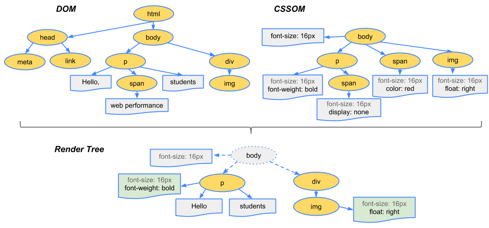

# 리액트 학습(Udemy-React - The Complete Guide 2025 (incl. Next.js, Redux)

## **리액트**

함수 컴포넌트형 JS 라이브러리. HTML/CSS/JS를 파일 포맷으로 구분하지 않고 UI 컴포넌트로 구분하자는 게 핵심 아이디어.JS로 만든 라이브러리이기 때문에 당연히 .js로 최종 컴파일된다. 하지만 Vite 등의 빌더 툴 내의 Babel 같은 트랜스파일러의 도움을 받아 요새는 대부분 .jsx 또는 .tsx로 작성된다.

.jsx(extended .js)는 원래의 js 컴파일러는 컴파일할 수 없는 확장된 구문을 제공한다. 쉽게 말하면 js코드에 뒤섞인 HTML이 .jsx가 제공하는 확장된 구문이다. 아래 예시를 보면 리액트의 UI 컴포넌트가 어떤 식으로 HTML/CSS/JS를 하나의 함수로 모듈화 하는지 알 수 있다.


하나의 자바스크립트 함수 ```CoreConcept({image, title, description})```에 HTML(return문 전체), JS가 섞여 있다.

CSS 또한 위 태그에 인라인 스타일링 방식으로 ```<p style={{color: “green”}}>{description}</p>```처럼 적용할 수 있다. 다만 이 방식은 .jsx 기능이 아니라 JS 라이브러리인 styled-component가 제공하는 기능이다. 이렇게 한 소스 파일 안에서 HTML/CSS/JS + 리액트 라이브러리의 모든 요소를 활용하다 보니 편리한 만큼 복잡성도 커진다. 그렇기 때문에 리액트의 작업 프로세스 안에 다양한 의존 라이브러리가 들어와 있다는 걸 인지한 채로 학습하는 게 좋을 것 같다. .jsx, react, styled-component 등 여러 의존성이 각자 어떤 역할을 수행하는지 알고 학습해야 문제 발생 시에 정확한 원인을 찾아 해결할 수 있다.

이 함수는 최상위 컴포넌트인 App.jsx에서 최종적으로 활용된다.JS 구문 안에서 쓰인 HTML이 .jsx 구문이다. 조금 심화하면 저렇게 HTML로 쓰인 구문이 트랜스 파일러(보통 Vite같은 빌더 툴에 포함)로 비슷한 추상화 레벨의 언어인 JS로 번역된다.


.jsx를 .js 파일로 트랜스파일하면 위의 HTML이 아래의 React.createElemenet 함수와 그 인자로 번역된다.

.jsx 내부에서 자바스크립트 문법을 쓰려면 {}로 래핑해야 한다. 위 예시에서도 ```<h1>Hello, {name}!\</h1>``` 과 같이 .jsx 문법으로 쓰인 
```<h1>``` 태그 안에 JS로 선언된 name을 넣기 위해 대괄호로 감싸준 모습을 볼 수 있다. 이것과 별개로 ```CoreConcept({image, title, description})```처럼 함수의 파라미터에 들어간 ```{image, title, decription}```은 JS의 네이티브 디스트럭쳐링 문법이므로 .jsx와 혼동하면 안된다.

## **리액트의 동작**

작성된 UI 컴포넌트들은 최상위 App() 함수에서 조합되어 쓰인다.


이 App() 함수는 리액트 프로젝트의 디폴트 엔트리 포인트이다. 그런데 리액트는 어떻게 App() 함수를 실행해서 브라우저의 프론트 페이지 전체를 구성하는 것일까? 리액트의 프론트 페이지는 리액트 프로젝트 내의 index.html이라는 단일 페이지로 드러난다. 아래의 프론트 페이지는 위 App() 함수의 실제 실행 결과로 만들어진 프론트 페이지이다.


위 페이지의 HTML 파일인 index.html의 내용은 다음과 같다.


9-12번까지 정의된 ```<body>``` 태그를 보면 ```<div id=”root”>``` 태그로 감싼 ```<script type=”module” src=”/src/index.jsx”></script>```가 보인다. 그것 뿐이다. 그 외에 페이지에 보이는 다른 태그들을 찾아볼 수 없다. 모두 어디로 간 것일까? 답은 ```<div id=”root”>``` 태그로 감싼 ```<script type=”module” src=”/src/index.jsx”></script>```에 있다. 이 script 태그 한 줄에 있는 index.jsx 파일이 전체 화면을 만들어내는 것이다. index.jsx파일은 어떻게 단 한 줄의 script 태그로 리액트 페이지 전체를 구성하는 것일까? 

→ 빌드된 JS 번들 안에 index.jsx를 시작으로 하는 모든 컴포넌트 트리가 등록되기 때문이다. 이제 index.jsx 파일의 내용을 보자.


7-8번과 주석처리된 10번의 코드는 모두 동일한 작업을 수행한다.

8번을 보자.

리액트는 VDOM이라는 가상의 DOM(Document Object Model)객체를 만들어 UI 컴포넌트를 관리한다. ReactDOM은 메모리 상의 추상화된 UI 트리구조인  VDOM을 실제 DOM으로 변환하는 역할을 한다. 이때 ```createRoot(entryPoint)``` 함수는 ReactDOM이 가상의 VDOM을 실제 DOM과 연결하기 위한 앵커 지점(root DOM node) 을 설정하게 한다. 엔트리 포인트는 VDOM과 DOM 공통의 시작 노드가 된다.

### DOM(Document Object Model)

DOM은 HTML/CSS내의 문서적 요소를 JS 내의 객체로 다룰 수 있게 만든 모델이다. DOM은 최상위 루트 노드를 기준으로 이하의 element(태그 요소)와 attribute(태그 요소가 가지고 있는 속성들, 이를테면 ```<div id=”root”></div>```에서 ```id=”root”```와 같은 속성)을 노드로 갖는 트리 구조로 구성된다.

다시 리액트로 돌아가면 리액트는 DOM을 만들어 브라우저에 보내기 전에 리액트의 추상화된 UI 모델인 VDOM(Virtual DOM)을 활용한다. VDOM이라는 추가적인 단계를 두는 이유는 Synthetic Event, 컴포넌트 관리(앞서 말한 HTML/CSS/JS가 합쳐진 통합 UI 컴포넌트), 부분 렌더링(상태 관리를 통해 기존의 DOM과 리액트만의 VDOM을 diffing한 후 부분적으로만 렌더링 처리)등 리액트만의 최적화된 기술을 적용하기 위함이다.

7번 코드를 보면 ```const entryPoint```에 ```document.getElementByID(”root”)```를 통해 HTML의 ```<div id=”root”>``` 요소가 할당된다.

```ReactDOM```은 ```.createRoot(entryPoint)```로 DOM의 엔트리 포인트로 이 ```entryPoint``` 객체를 할당한다.

이 객체는 이전의 index.html에서 ```<div id=”root”>``` 태그에 해당된다. 이후 ```ReactDOM.render(<App />)```를 통해 App 컴포넌트의 모든 UI 요소가 ```<div id="root">``` 내부에 렌더링된다.

지금까지 index.html -> index.jsx -> App()으로 이어지는 리액트의 작업 흐름을 알아봤다.

리액트의 방식이 DOM 객체를 다루는 기존의 패러다임을 완전히 바꿔놓은 것 같다는 생각이 든다. 기존의 프론트 처리 방식은 HTML/CSS로 미리 정의된 문서 요소를 JS 내부에서 객체화하고 이를 조작하는 수순이었다. 웹의 역사와 관련이 있는 것 같은데, 텍스트 문서를 관리하기 위해 HTML이라는 레이아웃 처리용 마크업 언어가 등장했고, 이후 시각적 효과를 위해 CSS가 독립했다. 자바스크립트의 전신인 라이브 스크립트는 최종적으로 마크업 문서와 시각적 요소의 상호작용을 구현하고자 고안됐다. 그리고 프론트 페이지의 개발은 이렇게 독립적인 역할로 구분된 문서들을 JS로 연결, 조작하는 명령형 방식으로 진행됐다.

그러나 리액트의 작업흐름은 전통적인 프론트엔드의 작업 흐름을 역전시켰다. 리액트는 index.html에서 볼 수 있듯, 미리 정의하는 HTML/CSS 요소를 최소화한다. 이전에 HTML/CSS에서 미리 정의하고 객체화했던 문서 요소는 이제 더이상 JS 바깥에 미리 선언되지 않는다. 리액트와 .jsx, tailwindCSS등의 라이브러리가 HTML/CSS 요소를 별도의 객체로 정의하지 않고도 JS와 함께 사용할 수 있게 해준 덕이다. 리액트는 그것들을 함수로 감싸 JS의 함수처럼 다룬다. 

이렇듯 리액트는 선언형 프로그래밍 방식으로 UI를 구성한다. 이렇게 하면 기존 명령형 방식의 DOM 조작보다 코드의 유지보수성과 재사용성이 뛰어나다는 장점이 있다.

### +브라우저의 DOM의 렌더링 과정(렌더링 엔진)

1. 브라우저의 렌더링 엔진이 HTML을 파싱해 트리 구조의 DOM으로 만든다.
2. 1번 과정에서 CSS 파일을 만나면 해당 CSS 파일도 다운로드한다.
3. 2번에서 다운로드한 CSS를 파싱해 트리 구조의 CSSOM을 만든다.
4. DOM을 순회한다. 이떄 보이지 않는 요소(display : none)는 제외한다. 이때 순회중인 노드에 CSSOM 정보가 있다면 여기서 발견한 CSS를 이 노드에 적용한다. 이 과정은 5, 6번으로 구분된다.
5. 레이아웃: 순회한 DOM 노드를 기반으로 레이아웃 연산을 한다. 레이아웃 과정을 거치면 반드시 페인팅 과정도 거친다. 
6. 페인팅: 레이아웃 연산이 끝난 노드에 실제 CSS를 적용한다.


### +VDOM(react-dom)

SPA(Single Page Application)으로 브라우저는 페이지 변경시마다 새 HTML을 받지 않고도 페이지의 변경사항을 적용해 매끄러운 렌더링을 할 수 있게 됐다. 기존 방식은 브라우저가 화면을 새로 그릴 때마다 이전 화면이 초기화되어 깜빡임이 발생했다. SPA는 부분 렌더링을 통해 기존의 맥락과 다음 페이지의 맥락을 유기적이고 매끄럽게 연결했다.(화면이 부드러워지는 것 뿐 아니라 화면 변경 시에도 데이터 스트리밍 맥락을 유지한다. 유튜브 뮤직을 떠올려 보자.) 

그러나 이 경우 기존 DOM을 폐기하고 새 HTML을 다시 그리는 방식보다 더 큰 연산 비용이 요구됐다. 하나의 페이지에서 계속해서 요소의 위치를 재계산해야 하기 때문이었다. SPA는 라우팅 변경 시 사이드바, 헤더와 같은 고정 요소를 제외한 모든 요소를 삭제, 삽입, 위치 계산을 수행해야 했다. 

이런 연산비용 문제를 해결하기 위해 등장한 것이 VDOM이다. react-dom은 VDOM을 만들어 온전히 브라우저가 부담해야 했을 렌더링 연산을 프론트엔드 서버에서 분담할 수 있게 만들었다.

**React Fiber**

리액트 파이버는 리액트에서 관리하는 JS 객체이다. 파이버 재조정자(Fiber Reconciler)가 관리하는데, 앞서 얘기한 DOM과 VDOM를 비교해 변경 사항을 수집하며 여기서 차이가 발생하면 관련 정보를 가지고 있는 파이버를 기준으로 화면에 렌더링을 요청한다. 재조정(Reconciliation)은 리액트가 어떤 부분을 다시 렌더링해야 하는지 VDOM, DOM을 비교하는 작업(알고리즘)이다.

### +VDOM을 활용한 부분 렌더링(렌더링 최적화)

VDOM은 컴포넌트 상태가 변경될 때(```useState()```가 할당된 클로저의 참조값이 바뀔 때), 모든 DOM을 다시 그리는 게 아니라 변경된 부분만 찾아 실제 DOM에 반영하기 위해 사용한다. 

상태 변화 이전의 VDOM과 현재의 VDOM을 diff해서(Reconciliation) 차이가 있는 부분만 다시 렌더링하기 때문에 컴포넌트 함수가 다루는 모든 DOM 요소를 다시 그릴 필요가 없다. 달리 말해 렌더링이 다시 요구될 때, 컴포넌트 함수의 모든 라인은 재실행되지만 VDOM과 비교해 상태가 변경된 DOM 요소만 다시 그린다. → 함수 내부의 특정 변수가 변경돼도 그 변수가 상태값이 아니면 변화를 렌더링에 반영하지 않는다.

### +리액트의 렌더링

위에서 브라우저의 렌더링을 학습했는데 리액트의 렌더링은 브라우저의 렌더링과 구분되는 개념이다. 위에서 SPA의 연산 부담을 줄이기 위해 리액트가 VDOM을 사용한다는 것을 배웠다. 리액트의 렌더링은 이처럼 브라우저에게 연산 부담을 주기 전에 프론트 엔드 서버(리액트 프로세스)가 우선적으로 렌더링 연산을 하는 것을 말한다.

더 구체적으로 리액트 렌더링은 리액트 애플리케이션 트리 안에 있는 모든 컴포넌트들이 자신의 props와 state 값을 기반으로 어떻게 UI를 구성하고, 그렇게 구성한 DOM 결과를 브라우저에 제공할 것인지 계산하는 일련의 과정을 의미한다. 만약 컴포넌트가 상태값을 가지고 있지 않다면 해당 컴포넌트가 반환하는 JSX 값에 기반해 렌더링이 계산된다. 리액트에서 렌더링이 언제 어떻게 일어나는지 보다 구체적으로 알아보자.

1. 최초 렌더링: 사용자가 앱에 진입할 때, 리액트는 브라우저에 앱 정보를 제공하기 위해 최초 렌더링을 수행.
2. 리렌더링: [함수형 컴포넌트만 다룸] useState()의 세터가 실행되는 경우, useReducer()의 dispatch가 실행되는 경우, 컴포넌트의 key props가 변경되는 경우, 부모 컴포넌트가 리렌더링되는 경우 자식 컴포넌트도 무조건 리렌더링 됨.
- 리액트에서 key는 모든 컴포넌트에서 사용할 수 있는 특수 props다. 일반적으로는 배열에서 하위 컴포넌트를 선언할 때 사용된다. 리렌더링이 진행되는 동안 리스트나 테이블의 동종적인 형제 요소들을 구분하기 위해 쓰인다. key가 없으면 파이버 내부의 sibling(형제 요소의 속성) 인덱스만으로 구별해야 한다.

**렌더와 커밋**

렌더링 프로세스는 렌더와 커밋 2단계로 나뉜다. 렌더 단계에서는 컴포넌트를 렌더링하고 변경 사항을 계산한다. 크게 types, props, key를 이전의 VDOM을 비교한다. 커밋 단계는 렌더 단계의 변경 사항을 실제 DOM에 적용해 사용자에게 보여주는 과정을 말한다. 이 단계가 끝나야 브라우저의 렌더링이 실행된다.

중요한 사실은 리액트의 렌더링이 실행됐다고 해서 무조건 DOM 업데이트가 일어나는 게 아니라는 점이다. 리액트가 렌더링을 수행했지만 커밋할 필요가 없다면, 달리 말해 변경 사항이 없다면 커밋 단계는 생략된다. 렌더링 연산은 했지만 변화는 없을 수 있는 것이다. 

렌더와 커밋은 항상 동기식으로 작동했다. 불가피하게 렌더링의 요구 연산량이 커질수록 앱 성능 저하가 발생했다. 이에 대한 한 가지 대안으로 리액트 18은 우선순위를 둔 비동기 렌더링, 다른 말로 동시성 렌더링을 도입했다. A 컴포넌트의 렌더링 작업이 무겁지만 B, C 컴포넌트는 상대적으로 가벼운 경우, 의도된 우선순위로 B, C 컴포넌트의 변경 사항만 우선적으로 렌더링할 수 있다. 이에 관해서는 나중에 리액트 18버전을 공부하며 심화하자.

### +JS엔진이 하는 일과 브라우저가 하는 일

자바스크립트 코드로 이벤트 처리, 타이머 설정, DOM 조작까지 처리하니 그걸 다 JS엔진이 한다고 착각할 수 있다. 그러나 실제로 JS 엔진이 하는 일은 다음과 같다.

1. 파싱 → 코드를 토큰으로 바꾸고 AST(Abstract Syntax Tree)로 변환, 구문 오류 감지
2. 컴파일(인터프리터 + JIT 컴파일러) → 인터프리터가 느리게 실행하다가 반복되는 함수나 루프는 JIT 컴파일러가 기계어로 변환, 빠르게 재사용
3. 실행 → 변수 할당, 객체 생성, 스코프 관리 등 코드 연산 처리
4. 콜백 큐와 이벤트 루프 인터페이스 처리 → 이벤트 루프는 브라우저/Node.js에서 담당하지만 콜백을 콜 스택에 밀어넣고, 그 콜백이 돌아왔을 때 실행하는 건 JS엔진
5. 가비지 컬렉션

**브라우저가 하는 일**

1. DOM 조작(렌더링 엔진)
2. 이벤트 처리
3. 네트워크 요청(fetch 등)
4. 타이머(setTimeout 등)
5. localStorage 등 Web API

### +리액트의 Synthetic Event

리액트는 브라우저의 ```addEventListner()```를 직접 쓰지 않는다. 대신 자체적으로 ```SyntheticEvent ```시스템을 구현해서 이벤트 리스닝은 최상위에서 한 번만 하고, 이벤트 버블링을 통해 이를 가능하게 한다.

리액트에서는 UI 컴포넌트에서 ```onClick``` 같은 이벤트가 발생하면 VDOM 트리를 따라가며 어떤 컴포넌트에 해당 이벤트가 연결됐는지 탐색한다. 이때``` onClick={handleClick}``` 처럼 등록된 함수는 리액트 내부의 디스패처가 찾아서 콜백처럼 호출해준다. 

원래 DOM의 이벤트 흐름은 다음과 같다.

1. Capturing Phase(루트에서 타겟까지 하향 전파, ```addEventListener()```로 리스닝)
    
    document → html → body → target
    
2. Target Phase(이벤트가 발생한 노드에서 처리됨)
3. Bubbling Phase(타겟에서 루트까지 상향 전파)
    
    target → body → html → document
    

실제 DOM 요소에 리스너를 걸어 진행된다. 그러나 리액트는 성능, 추상화, 일관성을 위해 이벤트를 DOM 요소마다 직접 붙이지 않는다.

**리액트의 SyntheticEvent**

```container.addEventListener('click', globalClickHandler);```
최상위 루트 DOM 요소(```container```)에 한 번만 리스너를 붙이고 이를 활용한다.

클릭 같은 이벤트가 발생하고 브라우저가 이를 DOM 트리 위로 상향 버블링하면 리액트는 루트에서 이 이벤트를 가로채  ```SyntheticEvent``` 객체(크로스 브라우저 문제 해결, 단일 인터페이스 제공)로 래핑한다. 이후 이벤트의 target을 기준으로 VDOM을 하향 탐색해서 해당 노드에 연결된 onClick을 찾아내고 등록된 콜백을 호출한다. 

**이벤트 위임과 이벤트 버블링**

```addEventListener```가 이벤트 발생 노드에 모두 있으면 가장 빠르게 이벤트에 대처할 수 있지만 그렇게 되면 이벤트 리스닝을 위해 낭비되는 메모리가 너무 커진다. 

```<ul>, <table>``` 같은 요소는 동질적인 자식 요소를 많이 두는데 이 모든 자식 요소에 일일이 이벤트리스너를 붙이면 메모리가 감당이 안 된다. 그래서 부모 요소인 ```<ul>, <table>``` 등의 이벤트 리스너를 하나만 정의하고 자식 노드에서 발생한 이벤트는 상향 propagation 되는 이벤트 버블링 → 이벤트 위임 패턴이 등장했다. 이때 부모는 자식 노드로부터 이벤트 처리를 위임받는다. 

리액트의 ```SyntheticEvent``` 처리는 위와 같은 기존의 이벤트 버블링 패턴을 극적으로 활용한 사례이다.

## Props, State, Two-Way-Binding

**Props**

부모 컴포넌트가 자식 컴포넌트에 데이터를 전달하는 수단.

읽기 전용(immutable) 객체 형태로 전달된다.

```jsx
function Welcome(props) {
	return <h1>Hello, {props.name}</h1>;
}

<Welcome name="Ironist" />
```

리액트에서는 구조 분해 할당 방식으로도 많이 사용된다.

```jsx
function Welcome({name, email}) {
	return (
	<h1>Hello, {name}</h1>
	<p>Your email: {email}</p>
	);
}

<Welcome name="Ironist" email:"hello123@gmail.com" />
```

```jsx
props = {
	name: 'Ironist',
	email: 'hello123@gmail.com'
}
```

위에서 Welcome의 속성으로 전달된 props는 위와 같은 객체로 전달된다.

```jsx
function Card({ children }) {
  return <div className="card">{children}</div>;
}

<Card>
  <p>Hello world</p> // children
</Card>
```

태그 사이에 다른 요소가 있으면 props는 자동으로 children이라는 이름의 프로퍼티를 갖는다.

```jsx
function Button({ onClick }) {
  return <button onClick={onClick}>Click me</button>;
}

<Button onClick={() => alert("Clicked")} />
```

부모 컴포넌트에서 자식 컴포넌트로 이벤트 핸들러 연결 시 함수도 전달한다.

```tsx
type WelcomeProps = {
  name: string;
};

function Welcome({ name }: WelcomeProps) {
  return <h1>Hello, {name}</h1>;
}

```

TS에서는 위와 같은 방식으로 선언해 props의 타입 안정성을 확보한다.

Props는 전통적 상속 구조를 따르지 않고 하향식으로 데이터를 전달한다. Props 전달은 명시적으로 이루어지며 단방향 데이터 흐름(Unidirectional Data Flow)를 보인다. 

**State**

컴포넌트 내부에 상태를 선언하고, 그 상태 변화에 따라 UI를 자동 갱신하는 훅이다.

```tsx
const [count, setCount] = useState(0);
```

useState()는 ```[state, setState]``` 형식의 2칸 짜리 배열을 반환한다.```[state[], setState()```가 반환) 0번 인덱스는 상태값 배열을 저장하고 1번 인덱스는 0번 인덱스의 상태값을 저장하기 위한 세터를 저장한다. 이때 세터는 클로저로 구현돼서 state 값을 캡슐화한다. → 컴포넌트 밖에서 state를 수정하면 안 되니까. → count를 직접 수정해도 렌더링에 반영하지 않는다. 리액트는 setState() 호출 시에만 재렌더링 요청을 인지한다.
setState가 호출되면 렌더링 트리거가 작동해 해당 컴포넌트를 다음 렌더링 사이클에 재렌더링한다. ‘**다음**’ 렌더링 사이클에 **비동기적**으로 렌더링 하는 것이다. setState 호출시 즉각적으로 재렌더링된다고 착각해서는 안된다. 

state는 props와 달리 컴포넌트 내부에 설정되며 내부에서만 관리하고, 변경 가능한 동적인 데이터를 담는다. 반면 props는 외부에서 전달받은 읽기 전용 데이터로 컴포넌트를 사용하기 위한 정적 설정값이다. 컴포넌트 바깥에서 값이 조정될 수는 있어도 컴포넌트 안에 전달되면 정적으로만 사용되는 고정된 값이다.

```tsx
function Parent() {
  const [count, setCount] = useState(0);

  return (
    <Child count={count} onIncrement={() => setCount(count + 1)} />
  );
}

function Child({ count, onIncrement }) {
  return (
    <>
      <p>{count}</p>
      <button onClick={onIncrement}>증가</button>
    </>
  );
}

```

위 예시에서 Parent의 state가 정적인 props로 Child에 전달되는 것을 확인할 수 있다. Child 컴포넌트는 내부에서 직접 Parent의 state를 조작하지 않고, 읽기 전용 데이터로 UI를 세팅하는데 활용한다. Child의 onClick은 콜백으로 setCount(count + 1)을 받아 Parent 컴포넌트에 setCount(count + 1)을 요청하는 것이지 직접 상태변경 함수를 실행하는 것이 아니다.

**Two-Way-Binding**

UI와 데이터 모델이 연결되어 실시간으로 쌍방향 상호작용 하는 것.

입력이 모델을 바꾸고 모델의 변화가 입력값 상태를 바꾼다.

```tsx
import { useState } from 'react';

function TwoWayBindingExample() {
  const [name, setName] = useState('');

  const handleChange = (event) => {
    setName(event.target.value);
  };

  return (
    <div>
      <input type="text" value={name} onChange={handleChange} />
      <p>입력한 이름: {name}</p>
    </div>
  );
}

```

위의 사례처럼 input 칸에 텍스트를 입력하면 실시간으로 입력 텍스트가 변하는 상황이 대표적인 예시이다. 사용자의 입력이 실시간으로 name 데이터에 반영되고, setName이 호출되었으므로 리액트가 다시 name의 상태 변화를 재렌더링하는 순환이 발생한다.

원래 리액트는 단방향 바인딩 방식을 사용해 데이터 흐름이 명확하다는 게 장점이다. 그러나 이렇게 필요한 경우 명시적인 방법(상태관리 + 이벤트 핸들러)으로 양방향 바인딩을 직접 구현할 수 있다. 실시간 입력 반영, Form 상태 처리 또는 입력값이 즉각적으로 UI에 표시되어야 할 때 활용하면 된다.