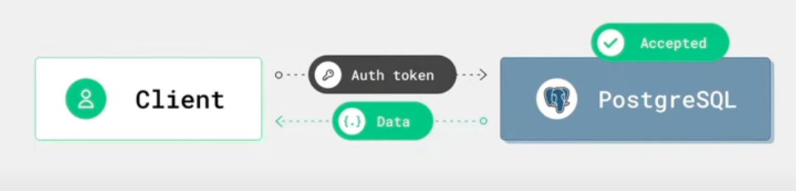
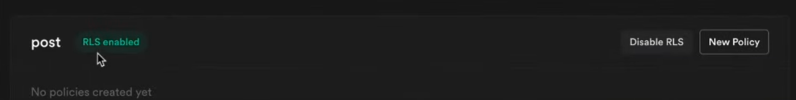
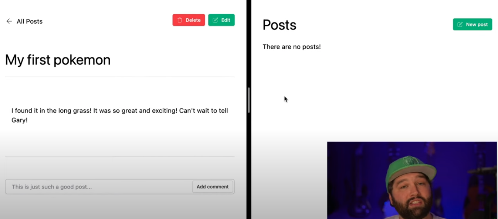

# RLS(Row Level Security)

[image.png](../img/rls1.png)

RLS가 없는 DB 호출 방식이다. 클라이언트가 인증 토큰으로 특정 데이터를 요구하는 콜을 API 서버에 전송한다. API 서버는 해당 토큰이 Redis 같은 RDB에 저장되어 있는지 확인 후 원하는 데이터를 PostgreSQL에서 찾아 반환한다.



RLS 하에서는 클라이언트가 PostgreSQL에 직접적으로 토큰 인증을 하고 데이터를 얻어온다. 이때 PostgreSQL은 사전 설정된 Policy에 의거해 데이터를 반환하게 된다. 클라이언트가 DB에 직접 접근할 수 있기 때문에 보안에 각별히 신경써야 한다.



예시에서는 Supabase를 사용했지만 PostgreSQL에서 직접 설정해도 똑같다. post 테이블 전체에 RLS를 걸자 모든 유저에게 post와 관련된 [CRUD 작업에 제한(Default)]이 걸렸다. RLS를 통해 전체 row에 CRUD 접근을 제한하면 이전에 post를 작성한 글 작성자도 본인이 작성한 글을 볼 수 없게 된다. 

접근 제한을 해제하는 유일한 방법은 Policy를 설정하는 것이다. 

```sql
CREATE POLICY "Enable all actions for users based on user_id" 
ON public.post
FOR ALL 
USING (auth.uid() = user_id) WITH CHECK (auth.uid() = user_id);
```



이렇게 할 경우 본인이 작성한 post를 본인이 CRUD할 수 있는 권한이 생긴다. 그러나 공개 목적으로 작성된 post도 본인이 아닌경우 READ가 불가능해지기 때문에 공개 게시판을 운영하기 위해서는 policy를 추가해야 한다.

```sql
CREATE POLICY "Enable user to select a published posts"
ON public.post 
FOR SELECT
USING (is_published = true);
```


이렇게 하면 is_published = true인 게시물은 모두가 공유할 수 있게 된다.

```sql
-- 1) 소유 데이터만 조회/수정
ALTER TABLE challenge ENABLE ROW LEVEL SECURITY;

CREATE POLICY "Own rows can be read"
ON challenge
FOR SELECT
USING (user_id = auth.uid());

CREATE POLICY "Own rows can be updated"
ON challenge
FOR UPDATE
USING (user_id = auth.uid())
WITH CHECK (user_id = auth.uid());

-- 2) 멀티테넌시: 같은 tenant_id만 접근
CREATE POLICY "Tenant isolation"
ON entry
FOR ALL
USING (tenant_id = current_setting('app.tenant_id')::uuid)
WITH CHECK (tenant_id = current_setting('app.tenant_id')::uuid);

```

위와 같이 더 세밀한 조정을 할 수도 있다.

## 열 마스킹/뷰

RLS는 tenant의 권한에 대한 접근 조정이다.  권한을 떠나 노출이 제한되는 민감한 열은 아예 뷰에서 제외하거나, 역할 별로 다른 뷰를 제공하는 것도 방법이다.

```sql
CREATE VIEW public_user AS
SELECT id, display_name
FROM "user"; -- email 등 민감정보 제외
GRANT SELECT ON public_user TO authenticated;
```

테이블에 대한 기본 GRANT는 최소화하고, **RLS + POLICY** 만으로 데이터 접근을 조정할 수도 있다.

## API와 RLS 구분

API가 처리할 일과 RLS, DB에서 처리할 일을 구분하기 위해 다음과 같은 기준을 두자. 

- **RLS = 접근권한**
    - “이 사용자에게 이 행을 허용할 수 있는가?”를 RLS로.
- **API = 절차/부작용(How the action happens)**
    - “이 행위를 지금 해도 되는가? 외부와 어떻게 상호작용하는가?”를 API로.
- **DB 제약은 무결성**
    - 외래키/UNIQUE/체크 제약/트리거로 *데이터 자체의 일관성* 보장.
- **view + security definer function**
    - 관리자가 전체 조회/집계해야 할 때는 `SECURITY DEFINER` 함수/뷰를 통해 **감사/권한 경로를 통제**(불특정 SELECT로 누수 방지).
- **서버에서만 가능한 일은 API**
    - 결제/이메일/서드파티 키 필요 작업은 무조건 API 경유.

## 적용

- **RLS: ON** (모든 테이블 기본 활성화)
- **정책**: “소유/역할/테넌트” 3축으로 단순·명시
- **API**: 외부 연동/워크플로우/속도제한/감사/풍부한 에러
- **보안 키 관리**: 서비스 롤은 서버 전용, 클라에서는 익명/유저 토큰만
- **문서화**: `SECURITY.md`에 정책 요약 + SQL 스니펫, `DATABASE.md`에 표/ERD와 함께 RLS 표기
- **테스트 자동화**: 권한별 쿼리/HTTP 테스트를 CI에서 돌려 회귀 방지
